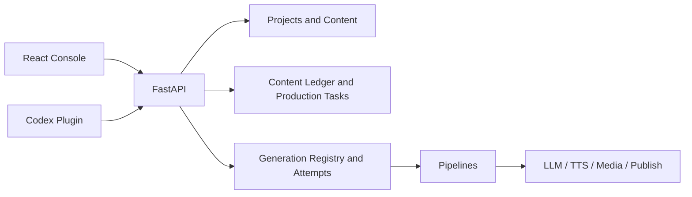

# Architecture

Pixelle is one business system composed of a React console, FastAPI contract layer, and Python production services.

## Layers

| Layer | Location | Responsibility |
| --- | --- | --- |
| Console | `apps/console` | Routing, interaction, and ViewModel rendering |
| API | `api` | HTTP contracts, validation, and task entry points |
| Content and production tasks | `pixelle_video/content` | Projects, content ledger, confirmation, and stable production tasks |
| Generation attempts | `pixelle_video/generation` | Templates, parameter merging, execution attempts, runtime, and quality |
| Pipelines | `pixelle_video/pipelines` | Artifact-specific production implementations |
| Services | `pixelle_video/services` | LLM, TTS, media, storage, and publishing |
| Content operations | `pixelle_video/content` | Projects, content items, and recoverable operations |
| Agent | `agent_plugin` + use-case API | Authenticated automation; confirmation remains human-only |

## Boundaries

- Every production request is compiled through the template registry before entering a pipeline.
- Stable production tasks are persisted by `pixelle_video/content/production_tasks.py`; execution attempts are persisted by `pixelle_video/generation`.
- The frontend does not interpret raw backend states; states are adapted into shared ViewModels.
- Projects, tasks, artifacts, and publishing state belong to backend persistence.
- API, console, and agent interfaces share the same business contracts and do not copy state machines.
- External provider failures remain explicit and cannot be hidden behind successful fallbacks.

See the [current product contract](../product/current-product.md) for the complete boundary.
