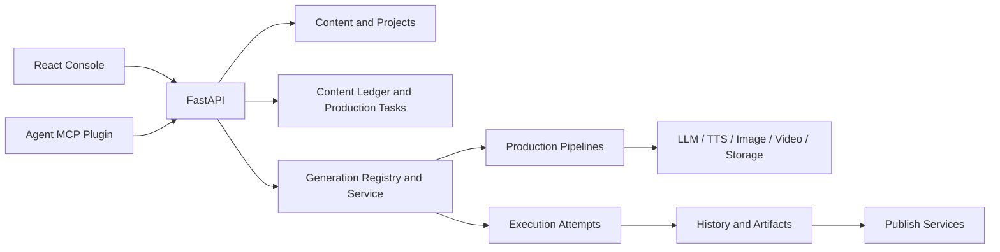

# Current Product Contract

This file defines product semantics and user-facing boundaries. The exact pipeline,
template, setting, state, and artifact catalog is generated at
[`docs/generated/system-contract.md`](../../generated/system-contract.md). Runtime availability
comes from `GET /api/agent/capabilities`.

## Product Definition

Pixelle is an AI content production workspace for solo content operators:

```text
Project → Content ledger → Production task → Artifact
                       └→ Confirmation / publish evidence / metrics
```

A project carries brand, channel, audience, language, and asset context, but does not bind one production route. People and agents create content-ledger records and production tasks through the same use-case APIs.

## Product Surfaces

The React console in `apps/console` has four primary destinations:

1. Workbench groups production tasks by confirmed facts: needs attention, in progress, failed, or produced.
2. Quick Production is the only React surface that starts production and selects an artifact type and template.
3. Library filters, previews, and publishes generated artifacts.
4. Settings manages projects, AI, voice, generation engines, storage, and templates.

Artifact types are declared by the generated executable contract rather than copied here.

## Runtime Architecture



| Layer | Location | Responsibility |
| --- | --- | --- |
| Product UI | `apps/console/src` | Routing, interaction, and ViewModel rendering |
| API | `api/routers`, `api/schemas` | HTTP contracts and permission boundaries |
| Production tasks | `pixelle_video/content/production_tasks.py` | User-visible flow from submission and confirmation to produced output |
| Execution attempts | `pixelle_video/generation` | Runtime progress, failure evidence, restart semantics, and artifacts |
| Content and projects | `pixelle_video/content` | Projects, content ledger, confirmation, publish evidence, and metrics |
| Registry and compilation | `pixelle_video/generation` | Recipe resolution, overrides, execution, and quality |
| Pipelines | `pixelle_video/pipelines` | Video, asset, image-set, text, and workflow routes |
| Services | `pixelle_video/services` | LLM, TTS, media, storage, and publishing |
| Agent interface | `agent_plugin` + `/api/agent/capabilities` | Thin MCP client over shared use-case APIs; confirmation remains human-only |

## Production Contract

One pipeline represents one input contract and one complete route. Different inputs, required stages, or required artifacts require different pipelines; providers and composition services remain reusable. The current contract has no `entry`, `entries`, or `default_entry` concept.

A template binds exactly one pipeline and stores long-lived defaults. Every formal production request creates or binds a content-ledger item and a stable `production_task_id` before starting a provider. The HTTP field remains `recipe_id` for compatibility. The old direct-generation write endpoints have been removed and are absent from OpenAPI. `/api/media/generate` is a settings preview and does not create a formal artifact.

Setting precedence is:

```text
Project defaults → Effective template defaults → Run overrides
```

The workbench consumes only persisted production-task states declared by the generated contract.

`produced` means execution succeeded and every required artifact is present and readable. Publishing and metrics do not alter that production fact. A service restart preserves terminal tasks and marks unfinished work as `interrupted` for explicit retry.

An unchanged retry appends an execution attempt. Changing the script, scenes, images, template, or effective parameters creates a new production task and preserves old tasks and artifacts.

## Code Constraints

- Routes, titles, layout, and project scope come from `apps/console/src/lib/router.ts`.
- Console pages consume API clients, adapters, and ViewModels.
- Raw provider, workflow, runtime, and backend status values do not enter ordinary product UI.
- Failures remain observable and cannot be hidden behind defaults, empty results, or fake success.
- New capabilities extend shared contracts instead of adding page-private implementations.

## Verification

- Python changes run `uv run pytest` and `uv run ruff check .`.
- Console changes run `typecheck`, `lint`, `test:p1`, `build`, and relevant Playwright tests.
- External publishing and billable provider calls require separate real-chain acceptance.
