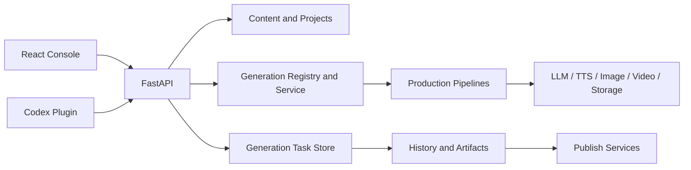

# Current Product Contract

This document describes the current product and code boundaries. Historical proposals, implementation phases, and migration records are not product sources of truth.

## Product Definition

Pixelle is an AI content production workspace for solo content operators:

```text
Project → Topic → Draft → Review → Production → Artifact → Publish
```

A project owns its content, languages, drafting behavior, production defaults, and publishing targets. People and automation operate the same entities through the same APIs.

## Product Surfaces

The React console in `apps/console` has five primary destinations:

1. Board for content lifecycle management.
2. Quick Create for recipe and artifact selection.
3. Tasks for run progress, cancellation, and retry.
4. Library for artifact preview and publishing.
5. Settings for projects, AI, voice, generation, storage, and recipes.

Artifacts are represented by one discriminated union: `video`, `image_set`, or `text`.

## Runtime Architecture



| Layer | Location | Responsibility |
| --- | --- | --- |
| Product UI | `apps/console/src` | Routing, interaction, and ViewModel rendering |
| API | `api/routers`, `api/schemas` | HTTP contracts and validation |
| Production Tasks | `pixelle_video/generation` | Task identity, durable state, progress, and restart semantics |
| Content | `pixelle_video/content` | Projects, content items, and drafting profiles |
| Generation | `pixelle_video/generation` | Recipe resolution, overrides, execution, and quality |
| Pipelines | `pixelle_video/pipelines` | Video, asset, image-set, text, and workflow pipelines |
| Services | `pixelle_video/services` | LLM, TTS, media, storage, and publishing |
| Operations | `ops` | Operating-project state and persistence |
| Agent Interface | `codex_plugin` | Controlled automation capabilities |

## Ownership and Contracts

- Backend persistence owns projects, content, tasks, artifacts, and publish attempts.
- The generation layer owns recipe registration and effective-parameter merging.
- The UI stores only unsubmitted drafts, presentation preferences, and URL-backed filters.
- Every production request is compiled through the recipe registry before entering a pipeline.
- Setting precedence is project defaults → effective recipe defaults → run overrides.
- The UI submits only overrides changed for the current run.
- Raw backend states are adapted to shared ViewModels before rendering.
- Unknown states remain unknown; they are not silently classified as running or complete.
- Failures remain observable and cannot be hidden behind default values or fake success.
- Production task state is durable. A restart preserves terminal tasks and marks unfinished work as `interrupted` for an explicit retry.
- Cancelling a batch stops only unfinished child tasks; completed artifacts remain available.
- Content production state advances on the backend from canonical production tasks. The UI never writes lifecycle transitions merely to reconcile a view.

## Verification

- Python changes run `uv run pytest` and `uv run ruff check .`.
- Console changes run `typecheck`, `lint`, `test:p1`, `build`, and relevant Playwright tests.
- External publishing and billable provider calls require separate real-chain acceptance.
