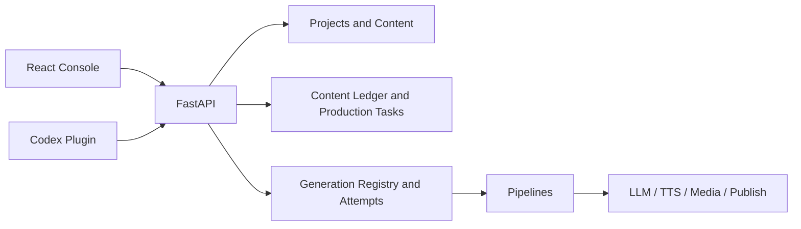

# 架构边界

Pixelle 使用 React 控制台、FastAPI 合同层和 Python 生产服务组成单一业务系统。本页只解释稳定分层；
精确 Pipeline、模板、设置和状态见[自动生成系统合同](../../generated/system-contract.md)，架构取舍见
[`docs/adr/`](../../adr/README.md)。

## 分层

| 层 | 位置 | 责任 |
| --- | --- | --- |
| 控制台 | `apps/console` | 路由、交互与 ViewModel 展示 |
| API | `api` | HTTP 合同、校验和任务入口 |
| 内容与生产任务 | `pixelle_video/content` | 项目、内容台账、人工确认与稳定生产任务 |
| 生成执行 | `pixelle_video/generation` | 模板、参数合并、执行尝试、运行和质量 |
| 管线 | `pixelle_video/pipelines` | 各产物生产实现 |
| 服务 | `pixelle_video/services` | LLM、TTS、媒体、存储和发布 |
| Agent | `agent_plugin` + 用例级 API | 认证后的受控自动化操作接口；确认仍由人在控制台完成 |

## 关键边界

- 所有正式生成先经过模板注册与编译，再进入具体管线。
- 稳定生产任务在 `pixelle_video/content/production_tasks.py` 持久化；底层执行尝试在 `pixelle_video/generation` 持久化。
- 前端不解释原始后端状态，状态先适配成统一 ViewModel。
- 项目、任务、产物和发布状态由后端持久化层拥有。
- API、控制台和 Agent 共用同一业务合同，不复制状态机。
- 外部供应商失败必须显式返回，不能通过 fallback 伪装成功。

更完整的产品边界见 [当前产品合同](../product/current-product.md)。
