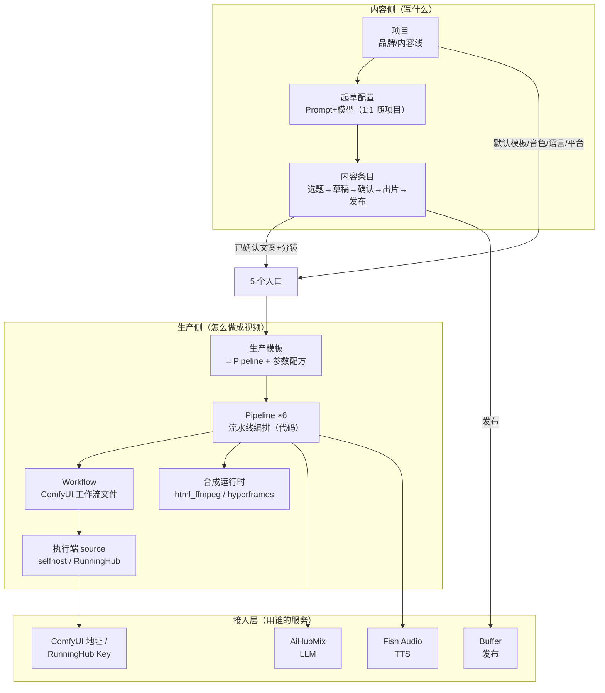

# Pixlle 架构总览 · 概念一次说清

> 读者：产品所有者（你）。目的：每个概念一句话定义、归属分层、在哪里改；然后诚实列出现状的纠缠点和收敛方向。
> 事实基准：2026-07-06 代码现状（多项目 + 起草配置 1:1 + 就地配置均已上线）。

## 1. 一图总览

三句话记住整个系统：

1. **内容侧管"写什么"**：项目（品牌）→ 起草配置（怎么写）→ 内容条目（生命周期档案）。
2. **生产侧管"怎么做成视频"**：模板（配方）→ Pipeline（流水线）→ Workflow（AI 能力）→ 执行端（算力在哪跑）。
3. **两侧在"入口"汇合**：内容带着已确认的文案分镜，模板带着生产参数，出片。

## 2. 概念词典（自下而上）

| 概念 | 一句话定义 | 数量/形态 | 在哪改 |
|---|---|---|---|
| **接入配置** | 各外部服务的钥匙和地址：AiHubMix Key、Fish Key、ComfyUI 地址、RunningHub Key、Buffer Token | 全局一份 | 设置页「系统设置」 |
| **执行端（source）** | 一个 AI 步骤的算力在哪跑：`selfhost`（你自己的 ComfyUI）或 `runninghub`（云端按量） | 模板参数之一 | 模板默认配置（零代码，白名单含 source） |
| **Workflow** | ComfyUI 工作流文件（.json），一个文件 = 一种 AI 能力（文生图、图生视频、动作迁移…） | `data/workflows/` | 换文件/加文件（代码或文件操作） |
| **Pipeline** | 写死在代码里的流水线编排：拿到输入后按什么步骤走（写稿→分镜→TTS→配图→合成） | 8 条：standard / custom / asset_based / image_post / long_form / i2v / action_transfer / digital_human | 代码（`pixelle_video/pipelines/`），不改 |
| **合成运行时** | 最后一步"图+音+字幕→成片"用什么引擎：`html_ffmpeg`（稳定默认）或 `hyperframes`（GSAP 动画，需本机 npx） | 模板参数之一（已解锁可覆盖） | 配方详情页 → 看产线 → 更换「合成」零件 |
| **生产模板** | **核心概念：配好参数的生产配方** = 选一条 Pipeline + 固定参数（fixed_params）+ 允许表单覆盖的白名单（allowed_user_params） | 内置 9 个真模板 + 1 个入口占位（多语言审核出片）+ 你的克隆 | 设置页「模板」tab 仅做库存管理（启用/停用/克隆/退役分组） |
| **模板默认配置** | 对某个模板的参数覆盖（比如把执行端换成 runninghub），存文件不动代码 | 每模板一份 | 配方详情页（快速生产 → 看产线 → 更换零件），唯一编辑入口 |
| **起草配置** | 内容怎么写：口播 Prompt + 分镜 Prompt + 模型。与项目 1:1，改 A 不影响 B | 每项目一份 | 项目详情页「起草配置」区 |
| **项目** | 品牌/内容线，全局作用域。管四类默认：起草配置、默认生产模板、语言+音色、发布平台 | 你有几个品牌就几个 | 设置页「项目」区 + 侧栏切换器 |
| **内容条目** | 一条内容的生命周期档案：选题→草稿→待确认→生产中→待发布→已发布→数据 | 看板每张卡 | 工作台 |
| **入口** | 内容与模板汇合出片的通道 | 4 个（见 §3；批量不再是独立入口，已并为生成页的「单条｜批量」提交模式） | — |
| **任务/批次** | 一次出片 = 若干任务打包成批次，任务中心轮询；批量 = 任一配方生成页的批量提交模式（script 入口粘多条、i2v 多图），非独立页面 | — | 生成页切「批量」提交；任务页「批次」区找回/重试 |

**配置优先级铁律**（全站一致）：`表单本次覆盖 > 项目默认 > 模板默认配置 > 模板内置参数`。前端已用来源 chip 显性化。

## 3. 一条视频的完整旅程（主路径）

1. **添加选题**（工作台）→ 条目入池，归当前项目。
2. **起草** → 用项目的起草配置（Prompt+模型）生成多语言草稿。*内容侧到此结束。*
3. **确认**（内容详情页/审核页）→ 逐语言确认标题、全文、**分镜行**。
4. **出片**（内容详情页/看板勾选）→ 选生产模板（默认=项目默认）：模板定 Pipeline 和参数 → Pipeline 按步骤跑：TTS（Fish）→ 每镜配图（Workflow→执行端算力）→ 合成（html_ffmpeg）。已确认分镜按行直出，不再重切。
5. **任务中心轮询** → 完成回写条目 → 待发布。
6. **发布**（作品库/抽屉）→ Buffer/小红书，回填数据，复盘。

## 4. 现状的纠缠点（诚实清单）

1. **模板命名按品牌不按能力**：6 个 `petwoods_xhs_*` 是 ops 单项目时代固化的，名字说"为谁而做"不说"能做什么"。多项目后概念错位：品牌属于项目，不属于配方。
2. **真假模板混列（部分收敛）**：「多语言审核出片」仍是入口占位（enabled=False，不能直接出片），却长得像模板。~~「批量生产」占位~~ 已消灭——批量改为任一生成页的「单条｜批量」提交模式，占位模板与批量页一并退役。
3. **Pipeline 概念对用户泄漏**：特殊生成入口（图生视频/动作迁移/数字人）本质是"一个 Pipeline 恰好只有一个模板"，与其他模板卡并列时用户无法理解为什么它们"长得不一样"。
4. **执行端（provider）视图碎片化**：LLM/TTS/发布的接入在设置页，selfhost/runninghub 却是模板参数——"我的算力都在哪跑、各花多少钱"没有统一视图。
5. **素材路径有两条**：素材增强/真实混剪模板（asset_based pipeline）和特殊生成（i2v 等）都回答"我有素材"，分组逻辑是实现视角不是用户视角。
6. ~~**合成运行时不可见**：hyperframes 已可用但藏在参数里，无处发现。~~ **（已解决）** compose_runtime 纳入覆盖白名单，标准线/素材线配方详情页可零代码把「合成」换成动效合成（缺 npx 时保存被拦并提示）。

## 5. 收敛方向（建议优先级）

**P0 · 命名与陈列（已完成）**
- 真模板已改能力导向名 + "适合何时用"描述（内部 id 不动，ops 兼容）。
- 快速生产页 v3 已按**产线**分区陈列配方卡（标准线 / 素材线 / Workflow 直跑），非早期"我有选题 / 我有文案 / 我有素材"三组；两张入口卡降级为「流程入口」列表条；特殊生成并入 Workflow 直跑板块。

**P1 · 执行端统一视图**
- 设置页加「执行端」区：selfhost 连接状态 + RunningHub 余量，并列出每个启用模板当前用哪个执行端（数据已有，纯聚合展示）。

**P2 · 概念收编（需要再讨论）**
- 特殊生成三个入口收编为普通模板卡（消灭"Pipeline 泄漏"）；素材两条路径合并陈列。
- hyperframes 作为模板默认配置里的显性选项（带效果说明）。

## 6. 速查：我想改 X，去哪里

| 想改什么 | 去哪 |
|---|---|
| 换口播风格/Prompt | 项目详情页 → 起草配置 |
| 换默认模板/音色/语言 | 项目详情页 |
| 把某模板的执行端换成云端 | 快速生产 → 看产线 → 更换「算力」零件 |
| 调 BGM/画面模板/TTS 模式默认 | 快速生产 → 看产线 → 更换对应零件（或「更多可调参数」） |
| 只想这一次改参数 | 出片面板 → 专家模式「本次覆盖」 |
| 换 LLM/Fish/Buffer 的 Key | 设置 → 系统设置 |
| 新品牌 | 设置 → 项目 → 新建（可复制现有默认值） |
