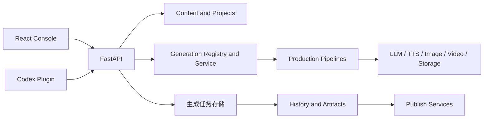

# Pixelle 当前产品合同

本文件只描述当前产品与代码边界。历史方案、实施批次和迁移过程不属于产品事实源。

## 产品定义

Pixelle 是面向单人内容运营的 AI 内容生产工作台。核心循环是：

```text
项目 → 选题 → 草稿 → 审核 → 生产 → 作品 → 发布
```

一个项目承载自己的内容、语言、起草方式、生产默认和发布目标。人和自动化工具通过同一组 API 操作相同实体，不维护两套业务状态。

## 正式产品表面

React 控制台位于 `apps/console`，包含五项主导航：

1. 工作台：按生命周期管理内容条目。
2. 快速生产：选择产物与配方，进入普通或专用生成。
3. 任务：查看一次提交及其子任务、取消和重试。
4. 作品库：筛选、预览和发布生成结果。
5. 设置：管理项目、AI、语音、生成引擎、存储和配方。

产物只有三种产品类型：`video`、`image_set`、`text`。界面、任务、历史和发布资格都必须以该判别联合为基础。

## 运行架构



| 层 | 代码位置 | 责任 |
| --- | --- | --- |
| 产品界面 | `apps/console/src` | 路由、交互、ViewModel 展示 |
| API | `api/routers`、`api/schemas` | HTTP 合同和权限边界 |
| 正式生成任务 | `pixelle_video/generation` | 任务身份、持久状态、运行进度与重启语义 |
| 内容与项目 | `pixelle_video/content` | 项目与内容条目；写稿 Prompt 和模型由生产配方管理 |
| 生产注册与编译 | `pixelle_video/generation` | 配方解析、覆盖合并、运行与质量 |
| 生产管线 | `pixelle_video/pipelines` | 视频、素材、图集、长文和工作流管线 |
| 媒体服务 | `pixelle_video/services` | LLM、TTS、图片、视频、存储和发布 |
| 运营状态 | `ops` | 运营项目、周期和写入状态 |
| Agent 接口 | `codex_plugin` | 对外暴露受控操作能力 |

## Legacy Streamlit 边界

`web/` 是冻结中的迁移期界面，不属于正式产品表面。新 Provider、新管线、设置和
任务能力不得继续接入 Streamlit；默认本地、Docker、Dev Container 与 Windows
入口只运行 React + FastAPI。`api/` 与 `pixelle_video/` 也不得反向导入 `web/`。

旧界面只允许用于尚未完成的兼容性排查，并且不能与 React 控制台同时修改配置。
待 Docker 与 Windows 发行形态完成真实验收后，删除旧界面及 Streamlit 依赖。

## 数据所有权

- 项目与内容事实由后端持久化层拥有，前端本地状态不能充当业务真源。
- 配方注册、有效参数和覆盖合并由 `pixelle_video/generation` 拥有。
- 正式生成任务的身份、状态和恢复语义由 `pixelle_video/generation` 拥有。
- 产物和历史由生成结果与历史服务拥有。
- 发布资格和发布尝试由发布服务拥有。
- UI 只保存草稿交互状态，例如未提交输入、展开状态和 URL 筛选。

## 生成合同

所有正式生成都从生产模板进入注册与编译层，再调用具体管线。页面不得绕过模板编译直接拼接内部请求。

设置合并顺序：

```text
项目默认 → 配方生效默认 → 本次覆盖
```

前端只提交本次真正修改的覆盖项。后端负责校验、合并和生成最终运行参数。

运行状态在进入 UI 前必须适配为统一状态：

```text
idle → uploading → submitting → queued → running
     → completed | failed | cancelling | cancelled | interrupted
```

未知后端状态必须被标记为未知，不能被静默归类。

任务状态持久化到后端数据目录。服务重启不会丢失终态；未完成任务会成为 `interrupted`，由用户明确重试。取消批次只取消尚未完成的子任务，已完成产物继续保留。

内容条目的生产状态由后端读取正式生成任务后推进。前端不得为了刷新看板而反向修改生命周期。

## 代码约束

- 路由、标题、布局与项目作用域以 `apps/console/src/lib/router.ts` 为唯一来源。
- 控制台页面只消费 API 客户端、适配器和 ViewModel。
- 后端 raw status、provider、workflow 和 runtime 不进入普通用户界面。
- 失败必须可观察，不能通过默认值、空结果或假成功掩盖。
- 新能力优先扩展共享合同，不在页面里复制私有实现。

## 验证边界

- Python 业务变更运行 `uv run pytest` 和 `uv run ruff check .`。
- 控制台变更运行 `typecheck`、`lint`、`test:p1`、`build` 和相关 Playwright 回归。
- 外部发布、真实供应商调用和消耗额度的生成必须单独进行真实链路验收。
