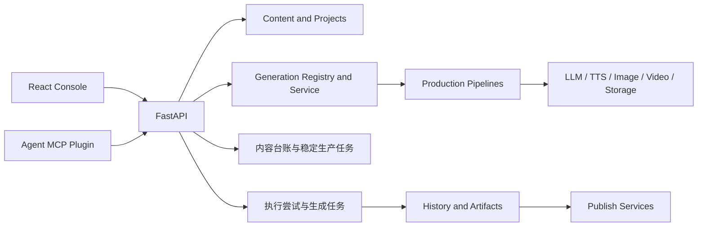

# Pixelle 当前产品合同

本文件只描述当前产品语义与用户体验边界。Pipeline、模板、字段、状态与产物类型的精确清单由
[`docs/generated/system-contract.md`](../../generated/system-contract.md) 自动生成；当前机器的可用能力读取
`GET /api/agent/capabilities`。历史方案、实施批次和迁移过程不属于产品事实源。

## 产品定义

Pixelle 是面向单人内容运营的 AI 内容生产工作台。核心关系是：

```text
项目 → 内容台账 → 生产任务 → 产物
              └→ 确认 / 发布证据 / 指标
```

一个项目承载品牌、渠道、受众、语言和素材背景，但不绑定唯一生产路线。人和 Agent 通过同一组用例接口建内容账和生产任务。

## 正式产品表面

React 控制台位于 `apps/console`，包含四项主导航：

1. 工作台：按确定事实查看“待你处理 / 进行中 / 异常 / 已产出”生产任务。
2. 快速生产：选择产物与模板，进入普通或专用生成。
3. 作品库：筛选、预览和发布生成结果，并可跳转快速生产再次制作。
4. 设置：管理项目、AI、语音、生成引擎、存储和模板。

React 只有「快速生产」可以创建新生产；工作台是监控和人工处理中心。任务详情只从工作台卡片进入，顶部展示唯一当前操作，下方按时间倒序展示真实输出与操作记录，不再跳转第二个「内容详情」。

界面、任务、历史和发布资格必须以自动生成合同声明的产物类型为基础，不在页面或本文另建清单。

## 运行架构



| 层 | 代码位置 | 责任 |
| --- | --- | --- |
| 产品界面 | `apps/console/src` | 路由、交互、ViewModel 展示 |
| API | `api/routers`、`api/schemas` | HTTP 合同和权限边界 |
| 稳定生产任务 | `pixelle_video/content/production_tasks.py` | 从提交、人工确认、执行到产出的用户可见任务 |
| 执行尝试 | `pixelle_video/generation` | 底层运行进度、失败证据、重启语义和产物 |
| 内容与项目 | `pixelle_video/content` | 项目、内容台账、人工确认、发布证据与指标 |
| 生产注册与编译 | `pixelle_video/generation` | 模板解析、覆盖合并、运行与质量 |
| 生产管线 | `pixelle_video/pipelines` | 视频、素材、图集、长文和工作流管线 |
| 媒体服务 | `pixelle_video/services` | LLM、TTS、图片、视频、存储和发布 |
| 内容运营状态 | `pixelle_video/content` | 项目、内容条目、发布证据与可恢复用例操作 |
| Agent 接口 | `agent_plugin` + `/api/agent/capabilities` | MCP 薄客户端与后端用例 API 共用业务规则；Agent 只能转交带版本与会话证据的用户明确确认 |

## 数据所有权

- 项目与内容事实由后端持久化层拥有，前端本地状态不能充当业务真源。
- 模板注册、有效参数和覆盖合并由 `pixelle_video/generation` 拥有。
- 正式生成任务的身份、状态和恢复语义由 `pixelle_video/generation` 拥有。
- 产物和历史由生成结果与历史服务拥有。
- 发布资格和发布尝试由发布服务拥有。
- UI 只保存草稿交互状态，例如未提交输入、展开状态和 URL 筛选。

## 生产合同

一条 Pipeline 只表达一种输入和一条完整路线。输入、必经步骤或必需产物不同时注册新 Pipeline，底层 Provider、配音、合成和保存步骤继续复用。新合同不包含 `entry / entries / default_entry`。

模板只绑定一条 Pipeline，保存该路线的长期设置，不能增删步骤。所有正式生产在启动 Provider 前必须先创建或绑定内容台账，并建立稳定 `production_task_id`。旧的直接生成写接口已删除，不在 OpenAPI 中暴露；`/api/media/generate` 只是配置页资源预览，不产生正式作品。

设置合并顺序：

```text
项目默认 → 模板生效默认 → 本次覆盖
```

前端只提交本次真正修改的覆盖项。后端负责校验、合并和生成最终运行参数。
配音服务在设置中选择系统默认；模板默认跟随系统，只有明确保存配音覆盖时才改用模板指定的服务和音色。任务建立时会把当时生效的配音服务、音色与语速写入任务快照，后续配置变化不会悄悄改变已建立的任务。

工作台只消费后端生产任务的确定状态，精确状态集合见自动生成合同。

只有执行成功且 Pipeline 的全部必需产物存在、可读时才是 `produced`。发布、指标和复盘不改变这个生产事实。前端不根据等待时长推测“疑似卡住”。

任务状态持久化到后端数据目录。服务重启不会丢失终态；未完成任务会成为 `interrupted`，由用户明确重试。快速生产的多条提交会直接建立多条独立生产任务，不建立用户可见的批次状态、批次卡片或批次重试。

同一生产的原样重试追加 execution attempt，不覆盖旧错误。人工确认站中的直接编辑、系统重写、局部重做和整套重做继续使用原生产任务，并使旧确认失效；已经产出后再改文案、素材、模板或有效参数，则从快速生产或 Agent 发起新任务，旧任务与旧产物保留。

正式路线与其输入、阶段、确认站和必需产物必须由 Pipeline Manifest 声明，并出现在自动生成合同中；本文不复制路线清单。

## 代码约束

- 路由、标题、布局与项目作用域以 `apps/console/src/lib/router.ts` 为唯一来源。
- 控制台页面只消费 API 客户端、适配器和 ViewModel。
- 后端 raw status、provider、workflow 和 runtime 不进入普通用户界面。
- 失败必须可观察，不能通过默认值、空结果或假成功掩盖。
- 新能力优先扩展共享合同，不在页面里复制私有实现。

## 验证边界

- Python 业务变更运行 `uv run pytest` 和 `uv run ruff check .`。
- 控制台变更运行 `typecheck`、`lint`、`test:p1`、`build` 和相关 Playwright 回归。
- 外部发布、真实供应商调用和消耗额度的生成必须单独进行真实链路验收。
