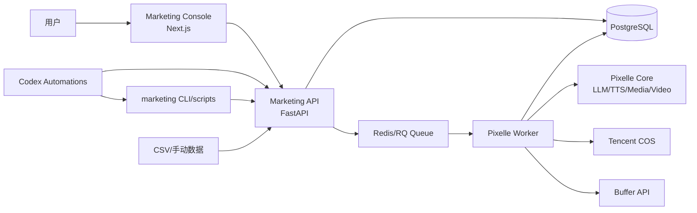
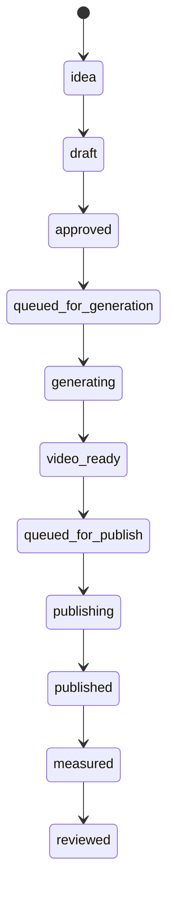
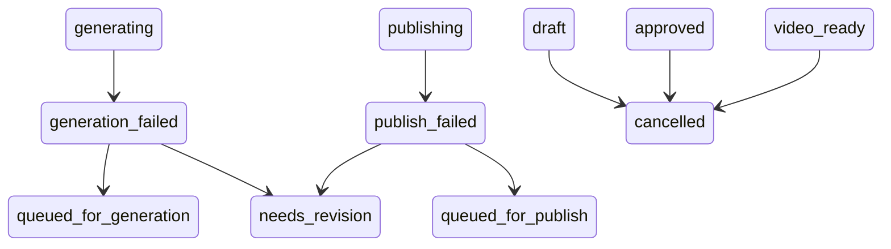

# Pixelle Marketing Console PRD

版本：v0.1  
日期：2026-05-28  
状态：开发前产品需求稿  
目标读者：产品、前端、后端、AI/自动化开发者  

---

## 1. 一句话目标

把 Pixelle 从“短视频生成工具”升级为个人可用的“AI 社媒营销工作台”：

```text
产品/概念 -> Campaign -> 内容队列 -> 视频生成 -> 发布 -> 数据回收 -> Codex 复盘优化 -> 下一轮营销
```

系统不做多租户 SaaS，不先追求全平台自动化，不把 Notion/Obsidian 当主系统。核心状态自建保存，Codex 作为运营大脑，Pixelle 作为生成和发布执行引擎。

## 2. 背景与当前问题

当前项目已经具备：

- 主题/脚本到视频生成能力。
- 多种 Pixelle pipeline，包括标准视频、自定义素材、图生视频、数字人、动作迁移。
- Streamlit Web UI。
- FastAPI API 基础。
- Buffer 发布集成。
- 腾讯云 COS 公开视频存储。
- 本地 `output/` 历史记录。

但当前能力仍以“生成视频”为中心，不适合作为个人营销闭环：

- 没有产品、账号、Campaign、内容队列这些营销业务对象。
- 生成记录和发布记录不是统一业务状态。
- 部分 pipeline 只生成 `final.mp4`，不进入统一历史/复盘链路。
- 发布入口藏在 History 页面，不是发布队列。
- 数据回收、订单线索和复盘优化没有结构化入口。
- Codex 定时任务没有稳定可调用的业务 API/脚本。

## 3. 产品定位

### 3.1 目标用户

第一阶段只服务一个个人用户：

- 自己有一个或多个产品/项目要推广。
- 管理一组社媒账号。
- 希望用 AI 批量生成内容和视频。
- 希望半自动或自动发布。
- 希望定期看到内容表现并优化下一轮内容。

### 3.2 核心使用场景

1. 用户录入产品档案和社媒账号。
2. 用户创建一个 Campaign，例如“PetWoods 6 月冷启动”。
3. Codex 或用户生成一批内容选题和脚本。
4. 用户审核内容后加入生成队列。
5. Pixelle Worker 生成视频，上传 COS，回写媒体资产。
6. 用户审核视频后加入发布队列。
7. 系统通过 Buffer 发布支持的平台；不稳定平台导出半自动发布包。
8. 用户手动录入或导入数据。
9. Codex 每周复盘，生成下一轮策略和内容建议。

### 3.3 非目标

MVP 不做：

- 多用户、多团队、权限管理。
- 完整 SaaS 计费。
- 全平台官方 API 自动发布。
- 复杂订单归因。
- 重型 BI。
- n8n 等外部流程编排作为主状态系统。
- 用 Notion/Obsidian 作为唯一业务数据库。

## 4. 成功标准

MVP 完成后，个人用户应能完成以下闭环：

1. 创建 1 个产品、2 个社媒账号、1 个 Campaign。
2. 在 Campaign 下创建至少 10 条内容。
3. 批量把内容状态推进到 `video_ready`。
4. 至少 1 条内容能生成视频、上传 COS，并可在页面预览。
5. 至少 1 条内容能提交 Buffer 或生成半自动发布包。
6. 用户能录入播放量、点赞、评论、订单线索。
7. 系统能生成一份 Campaign 周复盘。
8. Codex 定时任务可通过固定命令/API 读取待办并触发任务。

## 5. 推荐技术方案

### 5.1 总体搭配

```text
前端：Next.js App Router + TypeScript + Tailwind + shadcn/ui
后端 API：FastAPI
数据库：PostgreSQL
任务队列：Redis + RQ
视频/素材生成：现有 Pixelle Python Core
对象存储：腾讯云 COS
发布：Buffer API + 半自动发布包
AI 运营大脑：Codex Automations + 固定脚本/API
部署：Docker Compose，本地或 VPS
```

代码组织采用当前仓库内的轻量 monorepo：

```text
apps/console/       # Next.js Marketing Console
marketing/          # FastAPI routers, services, worker, db, CLI
pixelle_video/      # 保留现有 Pixelle Core
docker-compose.yml  # 增加 postgres、redis、api、worker、console
```

### 5.2 为什么不是继续只用 Streamlit

Streamlit 继续保留为调试台，但不作为最终操作台：

- 营销系统需要大量表格、看板、筛选、详情页、弹窗、进度和状态流转。
- 视频生成和发布属于后台任务，不应被页面请求生命周期绑定。
- Next.js 更适合做长期可维护的产品型控制台。

### 5.3 为什么不用 Notion/Obsidian 做主系统

Notion/Obsidian 可以作为辅助写作和资料库，但不作为主状态源：

- 生成任务、发布任务、失败重试、媒体资产、指标快照需要强一致结构化状态。
- 后续若接 Buffer、Metricool、平台数据、订单数据，数据库会比 Markdown/Notion API 更稳。
- 自建页面能直接承载视频预览、任务进度、错误处理、批量操作。

## 6. 系统架构



### 6.1 模块职责

| 模块 | 职责 | 不负责 |
| --- | --- | --- |
| Next.js Console | 页面、表格、看板、预览、表单、交互 | 视频生成、平台发布 |
| FastAPI | 业务 API、状态机、任务入队、数据校验 | 长耗时生成 |
| RQ Worker | 生成视频、上传 COS、发布 Buffer、导入数据 | 页面交互 |
| Pixelle Core | 复用现有生成能力 | 营销业务建模 |
| PostgreSQL | 唯一业务状态源 | 存大视频文件 |
| COS | 存视频、封面、图片、音频 | 营销业务状态 |
| Codex | 策略、计划、复盘、自动触发 | 持久化主状态 |

## 7. 核心业务对象

### 7.1 Product

产品或项目档案。

字段：

- `id`
- `name`
- `status`: `active | paused | archived`
- `one_liner`
- `target_audience`
- `pain_points`
- `value_props`
- `price`
- `landing_url`
- `coupon_code`
- `faq`
- `brand_voice`
- `forbidden_claims`
- `created_at`
- `updated_at`

### 7.2 Account

社媒账号档案。

字段：

- `id`
- `platform`: `xiaohongshu | tiktok | youtube | instagram | x | pinterest | other`
- `handle`
- `display_name`
- `positioning`
- `audience`
- `content_style`
- `publish_frequency`
- `preferred_formats`
- `buffer_channel_id`
- `publish_mode`: `buffer | manual_package`
- `status`

### 7.3 Campaign

一次营销活动。

字段：

- `id`
- `name`
- `product_id`
- `objective`: `awareness | engagement | conversion | retention`
- `start_date`
- `end_date`
- `primary_kpi`
- `budget_note`
- `strategy_brief`
- `status`: `draft | active | paused | completed`
- `weekly_review_note`

Campaign 与 Account 是多对多关系，通过 `campaign_accounts` 保存参与账号和账号级排期策略。

### 7.4 ContentItem

一条具体内容，是系统最核心对象。

字段：

- `id`
- `campaign_id`
- `product_id`
- `account_id`
- `platform`
- `title`
- `hook`
- `script`
- `caption`
- `hashtags`
- `content_goal`: `educate | seed | compare | testimonial | offer | conversion`
- `format`: `short_video | image_post | text_post | carousel`
- `status`
- `scheduled_at`
- `published_at`
- `platform_url`
- `source`: `manual | codex | imported`
- `codex_brief`
- `review_notes`

状态：

```text
idea -> draft -> approved -> queued_for_generation -> generating
-> video_ready -> queued_for_publish -> publishing -> published
-> measured -> reviewed
```

异常状态：

```text
generation_failed
publish_failed
needs_revision
cancelled
```

### 7.5 MediaAsset

视频、封面、图片、音频等产物。

字段：

- `id`
- `content_item_id`
- `asset_type`: `video | image | cover | audio | publish_package`
- `local_path`
- `public_url`
- `cos_key`
- `duration_seconds`
- `width`
- `height`
- `file_size`
- `metadata`
- `created_at`

### 7.6 Job

后台任务。

字段：

- `id`
- `job_type`: `generate_video | upload_media | publish_post | import_metrics | weekly_review`
- `content_item_id`
- `campaign_id`
- `status`: `queued | running | succeeded | failed | cancelled`
- `progress`
- `error_message`
- `attempt_count`
- `rq_job_id`
- `started_at`
- `finished_at`

### 7.7 PublishRecord

发布记录。

字段：

- `id`
- `content_item_id`
- `platform`
- `account_id`
- `publish_mode`: `buffer | manual_package`
- `status`: `pending | uploaded | scheduled | sent | failed`
- `public_video_url`
- `buffer_post_id`
- `platform_post_url`
- `scheduled_at`
- `sent_at`
- `error_message`
- `raw_response`

### 7.8 MetricsSnapshot

数据快照。

字段：

- `id`
- `content_item_id`
- `captured_at`
- `source`: `manual | csv | buffer | metricool | platform_api`
- `views`
- `likes`
- `comments`
- `shares`
- `saves`
- `clicks`
- `followers_delta`
- `orders`
- `revenue`
- `raw_payload`

### 7.9 Review

复盘记录。

字段：

- `id`
- `campaign_id`
- `period_start`
- `period_end`
- `summary`
- `winning_patterns`
- `losing_patterns`
- `next_actions`
- `generated_by`: `codex | manual`
- `created_at`

## 8. 页面结构

一级导航：

```text
Dashboard
Products
Accounts
Campaigns
Content Queue
Publish Calendar
Metrics
Reviews
Settings
```

## 9. 页面草图与交互逻辑

### 9.1 Dashboard

用途：用户每天打开的首页，显示今天该做什么。

```text
+--------------------------------------------------------------------------------+
| Pixelle Marketing Console                                      [Run Daily Sync] |
+--------------------------------------------------------------------------------+
| KPI Cards                                                                      |
| [Active Campaigns: 2] [To Generate: 8] [To Publish Today: 3] [Failed Jobs: 1] |
+--------------------------------------------------------------------------------+
| Today Queue                         | Weekly Review                            |
| - 09:00 Generate PetWoods #12       | Best platform: Xiaohongshu              |
| - 18:00 Publish PetWoods #08        | Best hook: "before/after pain"          |
| - Fill metrics for TikTok #05       | Next action: produce 5 comparison posts |
+--------------------------------------------------------------------------------+
| Recent Jobs                                                                    |
| Type              Item                 Status       Progress       Action       |
| generate_video    PetWoods hook 12     running      67%            View         |
| publish_post      PetWoods offer 08    failed       -              Retry        |
+--------------------------------------------------------------------------------+
```

前端交互：

- 点击 `Run Daily Sync` 调用 `POST /api/automation/daily-sync`。
- 点击失败任务 `Retry` 调用 `POST /api/jobs/{id}/retry`。
- KPI 卡片可点击跳转到对应筛选后的列表。
- Recent Jobs 通过轮询或 WebSocket 刷新。

后端逻辑：

- 聚合 campaign、content、job、metrics。
- 只展示最近 7 天和活跃 Campaign。
- `daily-sync` 不直接执行重任务，只入队待处理 job。

验收：

- 用户能在首页看到当天待生成、待发布、待补数据事项。
- 失败任务能从首页重试。

### 9.2 Products

用途：管理产品档案，作为内容生成和复盘的基础输入。

```text
+--------------------------------------------------------------+
| Products                                         [+ Product]  |
+--------------------------------------------------------------+
| Search... [active v]                                           |
+--------------------------------------------------------------+
| Name        Status   Audience        Active Campaigns  Action |
| PetWoods    active   Urban pet moms  2                 Edit   |
| Course A    paused   Indie makers    0                 Edit   |
+--------------------------------------------------------------+
```

产品详情：

```text
+------------------- Product: PetWoods ------------------------+
| Basic                                                        |
| Name [PetWoods] Status [active v] Landing URL [...........]  |
| One-liner [                                                ] |
+--------------------------------------------------------------+
| Positioning                                                  |
| Target Audience [                                         ]  |
| Pain Points     [                                         ]  |
| Value Props     [                                         ]  |
+--------------------------------------------------------------+
| Brand Guardrails                                             |
| Voice          [warm, practical, pet community tone]          |
| Forbidden Claims [medical claims, guaranteed results...]      |
+--------------------------------------------------------------+
| [Save] [Generate Campaign Ideas]                             |
+--------------------------------------------------------------+
```

前端交互：

- `+ Product` 打开创建页。
- `Generate Campaign Ideas` 调用 Codex planning endpoint 或生成 prompt，结果写入 Campaign 草稿。
- 保存前校验 `name` 必填。

后端逻辑：

- `POST /api/products`
- `PUT /api/products/{id}`
- Product 删除只允许软删除为 `archived`。

### 9.3 Accounts

用途：管理社媒账号、平台约束、发布方式。

```text
+--------------------------------------------------------------------+
| Accounts                                             [+ Account]   |
+--------------------------------------------------------------------+
| Platform     Handle        Publish Mode     Buffer Channel  Status |
| Xiaohongshu  @petwoods     manual_package   -               active |
| YouTube      @petwoods     buffer           channel_123      active |
| TikTok       @petwoods     buffer           channel_456      active |
+--------------------------------------------------------------------+
```

账号详情：

```text
+---------------- Account: Xiaohongshu @petwoods -------------------+
| Platform [xiaohongshu v] Handle [@petwoods] Status [active v]      |
| Publish Mode [manual_package v] Buffer Channel ID [disabled]       |
+--------------------------------------------------------------------+
| Positioning                                                        |
| Account Role [pet community practical advice]                      |
| Content Style [short hook, story, 4 image cards, soft CTA]         |
| Frequency [5 posts/week]                                           |
+--------------------------------------------------------------------+
| Platform Rules                                                     |
| Max Caption Length [1000] Hashtags [3-8] Risk Notes [avoid claims] |
+--------------------------------------------------------------------+
| [Save] [Test Buffer Channel]                                       |
+--------------------------------------------------------------------+
```

前端交互：

- 选择 `buffer` 发布方式时要求 `buffer_channel_id`。
- `Test Buffer Channel` 调用发布诊断。

后端逻辑：

- 校验平台和发布方式匹配。
- 手动发布账号不允许直接创建 Buffer publish job。

### 9.4 Campaigns

用途：创建营销活动，承载内容计划和复盘。

```text
+--------------------------------------------------------------------+
| Campaigns                                            [+ Campaign]  |
+--------------------------------------------------------------------+
| Name                    Product   Status   Period        KPI        |
| PetWoods 6月冷启动      PetWoods  active   06/01-06/30   orders     |
| PetWoods 信任建立       PetWoods  draft    07/01-07/15   saves      |
+--------------------------------------------------------------------+
```

Campaign 详情：

```text
+---------------- Campaign: PetWoods 6月冷启动 ----------------------+
| Product [PetWoods v] Objective [conversion v] Status [active v]    |
| Period  [2026-06-01] - [2026-06-30] Primary KPI [orders v]         |
+--------------------------------------------------------------------+
| Strategy Brief                                                     |
| [This campaign educates new pet owners on...]                      |
+--------------------------------------------------------------------+
| Content Mix                                                        |
| [Educate 30%] [Seed 30%] [Compare 20%] [Offer 20%]                 |
+--------------------------------------------------------------------+
| Actions                                                            |
| [Generate 10 Ideas] [Create Weekly Plan] [Open Queue] [Review]     |
+--------------------------------------------------------------------+
```

前端交互：

- `Generate 10 Ideas` 调用 `POST /api/campaigns/{id}/generate-ideas`，创建 `idea` 状态内容。
- `Create Weekly Plan` 按账号和频率生成排期。
- `Review` 跳转 Reviews。

后端逻辑：

- 生成内容时读取 product、accounts、campaign strategy。
- 不直接调用 Pixelle 生成视频，只创建内容项。

### 9.5 Content Queue

用途：核心操作页。管理所有内容状态。

```text
+--------------------------------------------------------------------------------+
| Content Queue                                                                  |
+--------------------------------------------------------------------------------+
| Filters: Campaign [PetWoods 6月 v] Platform [All v] Status [All v] Search...  |
+--------------------------------------------------------------------------------+
| View: [Table] [Kanban] [Calendar]                                              |
+--------------------------------------------------------------------------------+
| Title              Platform   Account     Status              Scheduled  Action |
| 3 signs your dog.. XHS        @petwoods   draft               -          Edit   |
| Why toys fail...   TikTok     @petwoods   video_ready         06/03 20:00 Publish|
| Pet anxiety myth   YouTube    @petwoods   generation_failed   -          Retry  |
+--------------------------------------------------------------------------------+
| Bulk Actions: [Approve] [Generate Videos] [Queue Publish] [Export CSV]         |
+--------------------------------------------------------------------------------+
```

Kanban 视图：

```text
+-------------+-------------+----------------+---------------+------------+
| Draft       | Approved    | Generating     | Video Ready   | Published  |
+-------------+-------------+----------------+---------------+------------+
| Card #1     | Card #4     | Card #7 67%    | Card #9       | Card #11   |
| Card #2     | Card #5     |                | Card #10      |            |
+-------------+-------------+----------------+---------------+------------+
```

前端交互：

- 单条内容点击进入详情。
- 批量选择 `approved` 内容，点击 `Generate Videos`。
- 状态变更必须走状态机，不能随意跳转。
- `Retry` 仅对失败状态显示。

后端逻辑：

- `GET /api/content-items?campaign_id=&status=&platform=`
- `PATCH /api/content-items/{id}`
- `POST /api/content-items/bulk-transition`
- `POST /api/content-items/bulk-generate`
- 批量生成时为每条内容创建 `generate_video` job。

### 9.6 Content Detail

用途：编辑一条内容、预览视频、查看发布和数据。

```text
+---------------- Content Detail ---------------------------------------------+
| Title [3 signs your dog is bored...]       Status [video_ready v]            |
| Campaign [PetWoods 6月] Product [PetWoods] Platform [Xiaohongshu]           |
+--------------------------------------------------------------------------------+
| Left: Copywriting                      | Right: Media Preview                  |
| Hook [..............................]  | +-----------------------------------+ |
| Script                                | |                                   | |
| [multi-line script editor]            | |          video preview            | |
| Caption                               | |                                   | |
| [caption editor]                      | +-----------------------------------+ |
| Hashtags [#pet #dog]                  | [Regenerate] [Upload/Replace]        |
+--------------------------------------------------------------------------------+
| Publishing                                                                     |
| Scheduled At [2026-06-03 20:00] Publish Mode [manual_package]                 |
| [Queue for Publish] [Create Publish Package] [Open Public URL]                |
+--------------------------------------------------------------------------------+
| Metrics                                                                        |
| Views [   ] Likes [   ] Comments [   ] Orders [   ] Revenue [   ] [Save]     |
+--------------------------------------------------------------------------------+
```

前端交互：

- Script/Caption 保存后，如果已有视频，提示“文案已变更，是否需要重新生成视频”。
- `Regenerate` 创建新 job，不覆盖旧资产，最新资产设为 active。
- `Queue for Publish` 要求存在 active video 或允许 text/image 类型。
- Metrics 保存后创建新的 `metrics_snapshot`，不是覆盖历史。

后端逻辑：

- 内容详情返回 content、active media、jobs、publish records、latest metrics。
- 媒体资产版本化。

### 9.7 Video Generation Modal

用途：启动视频生成并展示参数。

```text
+---------------- Generate Video ---------------------------------------------+
| Content: 3 signs your dog is bored                                           |
| Pipeline [standard v] Template [1080x1920/image_default v]                  |
| TTS Mode [fish/local/comfyui v] Voice [....]                                |
| Media Workflow [runninghub/image_flux.json v]                               |
| BGM [default.mp3 v] Volume [0.2]                                             |
+--------------------------------------------------------------------------------+
| Preflight                                                                     |
| [OK] LLM configured                                                           |
| [OK] TTS configured                                                           |
| [OK] RunningHub configured                                                    |
| [OK] COS configured                                                           |
+--------------------------------------------------------------------------------+
| [Start Generation] [Cancel]                                                   |
+--------------------------------------------------------------------------------+
```

生成中状态：

```text
+---------------- Job Progress -----------------------------------------------+
| generate_video: running                                                       |
| [██████████████████--------] 67%                                               |
| Current step: Frame 4/6 - generating media                                    |
| Logs:                                                                         |
| - Created task output dir                                                     |
| - Generated script                                                            |
| - Uploaded final.mp4 to COS                                                   |
+--------------------------------------------------------------------------------+
```

前端交互：

- 打开弹窗时调用 preflight。
- 生成期间锁定参数。
- 关闭弹窗不取消 job。
- job 成功后自动刷新 content detail。

后端逻辑：

- `POST /api/jobs/generate-video`
- `GET /api/jobs/{id}`
- `GET /api/jobs/{id}/events` 或 WebSocket。

### 9.8 Publish Calendar

用途：查看和管理发布日历。

```text
+--------------------------------------------------------------------------------+
| Publish Calendar                         [Week v] [Campaign v] [Platform v]    |
+--------------------------------------------------------------------------------+
| Mon 06/01       Tue 06/02       Wed 06/03       Thu 06/04       Fri 06/05      |
| XHS 20:00       TikTok 18:00    YouTube 19:00   XHS 20:00       TikTok 18:00   |
| Card #12        Card #13        Card #14        Card #15        Card #16       |
+--------------------------------------------------------------------------------+
| Unscheduled Video Ready                                                        |
| - Card #20 [Schedule]                                                          |
| - Card #21 [Schedule]                                                          |
+--------------------------------------------------------------------------------+
```

前端交互：

- 拖拽卡片到某天某时间，更新 `scheduled_at`。
- 只允许 `video_ready` 或 `queued_for_publish` 状态排期。
- 点击卡片进入详情。

后端逻辑：

- `GET /api/publish-calendar?start=&end=`
- `PATCH /api/content-items/{id}/schedule`

### 9.9 Publish Queue

用途：执行发布、查看失败、导出手动发布包。

```text
+--------------------------------------------------------------------------------+
| Publish Queue                                                                  |
+--------------------------------------------------------------------------------+
| Ready Today                                                                    |
| Title              Platform     Mode             Status       Action           |
| Dog boredom signs  YouTube      Buffer           pending      Publish Now      |
| Toy comparison     XHS          Manual Package   pending      Create Package   |
+--------------------------------------------------------------------------------+
| Failed                                                                          |
| Title              Platform     Error                         Action           |
| Offer post         TikTok       Buffer channel not configured Retry / Edit     |
+--------------------------------------------------------------------------------+
```

前端交互：

- `Publish Now` 创建 `publish_post` job。
- `Create Package` 生成可复制标题/正文/标签/视频路径的包。
- 发布失败显示原始错误和建议修复项。

后端逻辑：

- Buffer 平台调用现有 `PublishManager`，但结果写入 `publish_records`。
- 手动平台生成 `publish_package` media asset。
- 发布 job 要幂等：同一 content 同一 platform 已 scheduled 不重复创建。

### 9.10 Metrics

用途：录入或导入发布数据。

```text
+--------------------------------------------------------------------------------+
| Metrics                                                                        |
+--------------------------------------------------------------------------------+
| [Import CSV] [Manual Entry] [Template Download]                                |
+--------------------------------------------------------------------------------+
| Content              Platform  Views  Likes  Comments  Orders  Last Updated   |
| Dog boredom signs    XHS       1200   88     12        3       06/05 10:00    |
| Toy comparison       TikTok    4000   180    22        1       06/05 10:00    |
+--------------------------------------------------------------------------------+
```

CSV 导入弹窗：

```text
+---------------- Import Metrics CSV -----------------------------------------+
| File [choose file]                                                            |
| Mapping                                                                       |
| content_id column [content_id v] views [views v] likes [likes v]              |
| comments [comments v] orders [orders v] revenue [revenue v]                  |
| [Preview 10 rows]                                                             |
| [Import] [Cancel]                                                             |
+--------------------------------------------------------------------------------+
```

前端交互：

- 导入前预览解析结果。
- 找不到 content_id 的行进入错误列表，不中断其他行。
- 手动录入保存为新 snapshot。

后端逻辑：

- `POST /api/metrics/import-csv`
- `POST /api/metrics/manual`
- 按 content 聚合 latest metrics。

### 9.11 Reviews

用途：展示 Codex 或人工生成的复盘。

```text
+--------------------------------------------------------------------------------+
| Reviews                                                 [Generate Weekly Review]|
+--------------------------------------------------------------------------------+
| Campaign [PetWoods 6月冷启动 v] Period [2026-06-01 - 2026-06-07]              |
+--------------------------------------------------------------------------------+
| Summary                                                                        |
| This week, comparison posts outperformed educational posts by 2.4x saves...    |
+--------------------------------------------------------------------------------+
| Winning Patterns                 | Next Actions                                |
| - Before/after hook              | - Generate 5 more comparison posts          |
| - Pain-point title               | - Test shorter captions on TikTok           |
+--------------------------------------------------------------------------------+
| Related Content                                                                 |
| Top 5 by views / Top 5 by orders / Failed experiments                          |
+--------------------------------------------------------------------------------+
```

前端交互：

- `Generate Weekly Review` 创建 `weekly_review` job。
- 复盘结果可人工编辑。
- `Create Next Week Plan` 基于 review 创建新 content ideas。

后端逻辑：

- 聚合 campaign、content、metrics、orders。
- 生成结构化 prompt 给 Codex/LLM。
- 保存 Review，并可批量创建下一周 idea。

### 9.12 Settings

用途：配置系统和检查能力。

```text
+--------------------------------------------------------------------------------+
| Settings                                                                       |
+--------------------------------------------------------------------------------+
| AI / LLM                                                                       |
| API Key [******] Base URL [https://aihubmix.com/v1] Model [....] [Test]        |
+--------------------------------------------------------------------------------+
| Generation                                                                     |
| RunningHub Key [******] ComfyUI URL [http://127.0.0.1:8188] [Test]            |
| TTS Mode [local/fish/comfyui] Fish Key [******] [Test]                         |
+--------------------------------------------------------------------------------+
| Storage & Publish                                                              |
| COS Region [ap-hongkong] Bucket [pixlle-125xxx] Public URL [https://...]       |
| Buffer API Key [******] [Fetch Channels]                                       |
+--------------------------------------------------------------------------------+
| Preflight Matrix                                                               |
| Copy only       [OK] LLM                                                       |
| Generate video  [OK] LLM [OK] TTS [OK] RunningHub [OK] COS                    |
| Publish         [OK] COS [OK] Buffer/Manual                                    |
+--------------------------------------------------------------------------------+
```

前端交互：

- 不再用一个笼统“系统已配置”。
- 每个能力单独检查。
- 保存配置后重建 Pixelle core 相关缓存。

后端逻辑：

- `GET /api/settings`
- `PUT /api/settings`
- `POST /api/settings/preflight`

## 10. 后端 API 草案

### 10.1 Products

```http
GET    /api/products
POST   /api/products
GET    /api/products/{id}
PUT    /api/products/{id}
DELETE /api/products/{id}   # soft archive
```

### 10.2 Accounts

```http
GET    /api/accounts
POST   /api/accounts
GET    /api/accounts/{id}
PUT    /api/accounts/{id}
POST   /api/accounts/{id}/test-publish-channel
```

### 10.3 Campaigns

```http
GET    /api/campaigns
POST   /api/campaigns
GET    /api/campaigns/{id}
PUT    /api/campaigns/{id}
POST   /api/campaigns/{id}/generate-ideas
POST   /api/campaigns/{id}/create-weekly-plan
```

### 10.4 Content Items

```http
GET    /api/content-items
POST   /api/content-items
GET    /api/content-items/{id}
PUT    /api/content-items/{id}
POST   /api/content-items/{id}/transition
POST   /api/content-items/{id}/schedule
POST   /api/content-items/bulk-transition
POST   /api/content-items/bulk-generate
```

Transition request:

```json
{
  "target_status": "approved",
  "reason": "User approved script"
}
```

### 10.5 Jobs

```http
GET    /api/jobs
POST   /api/jobs/generate-video
POST   /api/jobs/publish-post
POST   /api/jobs/import-metrics
POST   /api/jobs/weekly-review
GET    /api/jobs/{id}
POST   /api/jobs/{id}/retry
POST   /api/jobs/{id}/cancel
GET    /api/jobs/{id}/events
```

### 10.6 Media

```http
GET    /api/media-assets?content_item_id=
POST   /api/media-assets/upload
POST   /api/media-assets/{id}/set-active
```

### 10.7 Publishing

```http
GET    /api/publish-records
POST   /api/publish-records/{content_item_id}/publish-now
POST   /api/publish-records/{content_item_id}/create-manual-package
GET    /api/publish-calendar
```

### 10.8 Metrics

```http
GET    /api/metrics?campaign_id=
POST   /api/metrics/manual
POST   /api/metrics/import-csv
GET    /api/metrics/template
```

### 10.9 Reviews

```http
GET    /api/reviews?campaign_id=
POST   /api/reviews/generate-weekly
PUT    /api/reviews/{id}
POST   /api/reviews/{id}/create-next-plan
```

### 10.10 Automation

供 Codex Automations 和 CLI 调用。

```http
POST   /api/automation/daily-sync
POST   /api/automation/generate-due
POST   /api/automation/publish-due
POST   /api/automation/weekly-review
GET    /api/automation/dry-run/daily-sync
```

要求：

- 默认支持 dry-run。
- 真正执行时需要 `confirm=true` 或内部 CLI token。
- 返回创建的 job id 列表，不直接阻塞等待长任务完成。

## 11. 状态机规则

### 11.1 正常流转



### 11.2 异常流转



### 11.3 规则

- `queued_for_generation` 必须有 `script`。
- `queued_for_publish` 必须有 active `media_asset`，除非 format 是 `text_post`。
- `published` 必须有 publish record。
- `measured` 必须至少有一个 metrics snapshot。
- `reviewed` 必须有关联 review 或人工 review note。
- 失败重试不能覆盖旧 job，必须创建新 job 并关联原 job。

## 12. Worker 任务逻辑

### 12.1 generate_video

输入：

- `content_item_id`
- `pipeline`
- `template`
- `tts_config`
- `media_workflow`
- `bgm_config`

步骤：

1. 加载 ContentItem、Product、Account、Campaign。
2. 校验 ContentItem 状态为 `queued_for_generation`。
3. 创建 Job，状态 `running`。
4. 调用 Pixelle Core 生成视频。
5. 生成 `final.mp4`、metadata、storyboard。
6. 上传视频到 COS。
7. 创建 MediaAsset。
8. ContentItem 状态改为 `video_ready`。
9. Job 状态改为 `succeeded`。

失败：

- Job 状态 `failed`。
- ContentItem 状态 `generation_failed`。
- 记录错误层级：`config | llm | tts | media | ffmpeg | storage | unknown`。

### 12.2 publish_post

输入：

- `content_item_id`
- `publish_mode`

步骤：

1. 加载 content、account、active media。
2. 校验状态为 `queued_for_publish`。
3. 如果 `publish_mode=buffer`：
   - 确认 public video URL。
   - 调用 Buffer 创建 post。
   - 保存 `buffer_post_id`。
4. 如果 `publish_mode=manual_package`：
   - 创建发布包，包括标题、正文、标签、视频路径、公开视频 URL。
5. 写 PublishRecord。
6. 成功后状态改为 `published` 或 `scheduled` 对应内部 published-ready 状态。

### 12.3 import_metrics

步骤：

1. 解析 CSV。
2. 校验列映射。
3. 对每行匹配 content item。
4. 创建 MetricsSnapshot。
5. 对有数据的 ContentItem 状态改为 `measured`。
6. 返回成功行和失败行。

### 12.4 weekly_review

步骤：

1. 按 campaign 和周期聚合内容和指标。
2. 生成复盘 prompt。
3. 调用 Codex/LLM。
4. 保存 Review。
5. 可选：创建下一周 idea。

## 13. Codex 自动化入口

固定命令：

```bash
marketing daily-sync
marketing generate-due
marketing publish-due
marketing import-metrics --file path.csv
marketing weekly-review --campaign-id xxx --period 2026-06-01:2026-06-07
```

要求：

- 命令必须幂等。
- 不直接修改数据库时必须输出 dry-run。
- 所有自动化写入要有 `source=codex` 或 `generated_by=codex`。
- 自动化失败要创建系统通知或 Job 错误。

## 14. 数据库设计草案

### 14.1 products

```sql
create table products (
  id uuid primary key,
  name text not null,
  status text not null default 'active',
  one_liner text,
  target_audience text,
  pain_points text,
  value_props text,
  price text,
  landing_url text,
  coupon_code text,
  faq jsonb not null default '[]',
  brand_voice text,
  forbidden_claims text,
  created_at timestamptz not null default now(),
  updated_at timestamptz not null default now()
);
```

### 14.2 accounts

```sql
create table accounts (
  id uuid primary key,
  platform text not null,
  handle text not null,
  display_name text,
  positioning text,
  audience text,
  content_style text,
  publish_frequency text,
  preferred_formats jsonb not null default '[]',
  publish_mode text not null default 'manual_package',
  buffer_channel_id text,
  status text not null default 'active',
  created_at timestamptz not null default now(),
  updated_at timestamptz not null default now()
);
```

### 14.3 campaigns

```sql
create table campaigns (
  id uuid primary key,
  product_id uuid not null references products(id),
  name text not null,
  objective text not null,
  status text not null default 'draft',
  start_date date,
  end_date date,
  primary_kpi text,
  strategy_brief text,
  created_at timestamptz not null default now(),
  updated_at timestamptz not null default now()
);
```

### 14.4 campaign_accounts

```sql
create table campaign_accounts (
  id uuid primary key,
  campaign_id uuid not null references campaigns(id),
  account_id uuid not null references accounts(id),
  weekly_frequency integer,
  preferred_publish_times jsonb not null default '[]',
  content_mix jsonb not null default '{}',
  created_at timestamptz not null default now(),
  unique (campaign_id, account_id)
);
```

### 14.5 content_items

```sql
create table content_items (
  id uuid primary key,
  campaign_id uuid not null references campaigns(id),
  product_id uuid not null references products(id),
  account_id uuid references accounts(id),
  platform text,
  title text,
  hook text,
  script text,
  caption text,
  hashtags jsonb not null default '[]',
  content_goal text,
  format text not null default 'short_video',
  status text not null default 'idea',
  scheduled_at timestamptz,
  published_at timestamptz,
  platform_url text,
  source text not null default 'manual',
  codex_brief text,
  review_notes text,
  created_at timestamptz not null default now(),
  updated_at timestamptz not null default now()
);
```

### 14.6 media_assets

```sql
create table media_assets (
  id uuid primary key,
  content_item_id uuid not null references content_items(id),
  asset_type text not null,
  is_active boolean not null default false,
  local_path text,
  public_url text,
  cos_key text,
  duration_seconds numeric,
  width integer,
  height integer,
  file_size bigint,
  metadata jsonb not null default '{}',
  created_at timestamptz not null default now()
);
```

### 14.7 jobs

```sql
create table jobs (
  id uuid primary key,
  job_type text not null,
  content_item_id uuid references content_items(id),
  campaign_id uuid references campaigns(id),
  status text not null default 'queued',
  progress integer not null default 0,
  error_message text,
  error_layer text,
  attempt_count integer not null default 0,
  rq_job_id text,
  payload jsonb not null default '{}',
  result jsonb not null default '{}',
  started_at timestamptz,
  finished_at timestamptz,
  created_at timestamptz not null default now()
);
```

### 14.8 job_events

```sql
create table job_events (
  id uuid primary key,
  job_id uuid not null references jobs(id),
  event_type text not null,
  progress integer,
  message text,
  payload jsonb not null default '{}',
  created_at timestamptz not null default now()
);
```

### 14.9 publish_records

```sql
create table publish_records (
  id uuid primary key,
  content_item_id uuid not null references content_items(id),
  platform text not null,
  account_id uuid references accounts(id),
  publish_mode text not null,
  status text not null default 'pending',
  public_video_url text,
  buffer_post_id text,
  platform_post_url text,
  scheduled_at timestamptz,
  sent_at timestamptz,
  error_message text,
  raw_response jsonb not null default '{}',
  created_at timestamptz not null default now(),
  updated_at timestamptz not null default now()
);
```

### 14.10 metrics_snapshots

```sql
create table metrics_snapshots (
  id uuid primary key,
  content_item_id uuid not null references content_items(id),
  captured_at timestamptz not null default now(),
  source text not null default 'manual',
  views integer,
  likes integer,
  comments integer,
  shares integer,
  saves integer,
  clicks integer,
  followers_delta integer,
  orders integer,
  revenue numeric,
  raw_payload jsonb not null default '{}'
);
```

### 14.11 reviews

```sql
create table reviews (
  id uuid primary key,
  campaign_id uuid not null references campaigns(id),
  period_start date not null,
  period_end date not null,
  summary text,
  winning_patterns jsonb not null default '[]',
  losing_patterns jsonb not null default '[]',
  next_actions jsonb not null default '[]',
  generated_by text not null default 'manual',
  created_at timestamptz not null default now(),
  updated_at timestamptz not null default now()
);
```

### 14.12 audit_logs

```sql
create table audit_logs (
  id uuid primary key,
  actor text not null,
  action text not null,
  entity_type text not null,
  entity_id uuid not null,
  before jsonb,
  after jsonb,
  reason text,
  created_at timestamptz not null default now()
);
```

## 15. 前端实现要求

### 15.1 技术规范

- Next.js App Router。
- TypeScript strict mode。
- Tailwind + shadcn/ui。
- 表格使用可排序、可筛选、可分页组件。
- 表单使用统一校验。
- 所有后台任务按钮必须显示 loading/disabled 状态。
- 长任务进度通过轮询或事件流展示。

### 15.2 交互原则

- 用户永远能看到内容当前状态和下一步动作。
- 生成、发布、导入等危险动作必须有确认或可撤销路径。
- 失败必须显示错误层级和可执行修复建议。
- 批量操作前显示将影响的内容数量。
- 不在前端直接调用 Pixelle Core；所有执行通过 FastAPI。

### 15.3 页面状态

每个列表页需要：

- 空状态。
- 加载状态。
- 错误状态。
- 筛选无结果状态。
- 批量操作状态。

每个详情页需要：

- 未保存变更提示。
- 保存成功 toast。
- 后台 job 进行中提示。
- 最新媒体资产预览。

## 16. 后端实现要求

### 16.1 FastAPI 分层

建议目录：

```text
marketing/
  api/
    routers/
    schemas/
    dependencies.py
  domain/
    state_machine.py
    preflight.py
    prompts.py
  services/
    products.py
    accounts.py
    campaigns.py
    content_items.py
    media_assets.py
    jobs.py
    publishing.py
    metrics.py
    reviews.py
  workers/
    queue.py
    tasks.py
    pixelle_adapter.py
  db/
    models.py
    migrations/
  cli.py
```

### 16.2 状态机集中管理

禁止在多个 service 中散落写状态。

```python
transition_content_item(item_id, target_status, actor, reason)
```

该函数负责：

- 校验合法流转。
- 写 audit log。
- 触发必要副作用。

### 16.3 Pixelle Adapter

不要让 marketing service 直接依赖 Streamlit 页面逻辑。

Adapter 职责：

- 根据 ContentItem 组装 Pixelle generate 参数。
- 调用 `PixelleVideoCore.generate_video`。
- 归一化不同 pipeline 的输出。
- 返回统一 `GeneratedMediaResult`。

统一返回：

```python
class GeneratedMediaResult:
    task_id: str
    video_path: str
    storyboard_path: str | None
    metadata_path: str | None
    duration_seconds: float | None
    width: int | None
    height: int | None
    file_size: int
```

### 16.4 Preflight

后端必须支持按能力检查：

```text
copywriting: LLM
video_generation: LLM + TTS + media workflow + ffmpeg + storage
publishing: storage + publish target
metrics_import: csv parser + matching rules
```

## 17. 安全与配置

MVP 是个人使用，但仍需避免基础风险：

- API 默认只监听本地或受信网络。
- 生产部署必须配置 CORS allowlist。
- API key 不返回给前端，只返回 masked 值。
- COS/Buffer/Fish/LLM key 存环境变量或加密配置。
- 发布前不自动跳过审核，除非 content item 明确 `auto_publish=true`。
- 所有外部 API 调用记录 request id、状态和错误，但不记录完整密钥。

## 18. 迁移当前 Pixelle 的改造点

### 18.1 保留

- Pixelle Core。
- 当前视频生成 pipeline。
- 当前 BufferPublisher。
- 当前 PublicMediaStorage/COS。
- 当前 Streamlit Settings 作为调试页面。

### 18.2 新增

- Marketing 数据库。
- FastAPI marketing routers。
- RQ worker。
- Pixelle adapter。
- Marketing Console 前端。
- CLI 命令。

### 18.3 必须修正

- 所有 pipeline 输出统一进入 MediaAsset/Job。
- 生成成功但持久化失败不能被视为完整成功。
- 配置检查按任务类型拆分。
- 发布记录从本地 `publish.json` 迁移到数据库。
- History 不再作为营销主入口，只作为低层生成记录或调试信息。

## 19. 开发里程碑

### Phase 1：业务骨架

目标：能管理产品、账号、Campaign、内容队列。

交付：

- Postgres schema。
- Products/Accounts/Campaigns/Content Queue API。
- Next.js 基础布局和列表/详情页。
- 状态机。

验收：

- 能创建产品、账号、Campaign。
- 能创建 10 条内容并推进状态到 `approved`。

### Phase 2：生成闭环

目标：内容能进入生成队列并得到视频。

交付：

- Redis/RQ。
- generate_video job。
- Pixelle adapter。
- MediaAsset。
- Job progress UI。

验收：

- 一条 approved 内容能生成视频。
- 页面能看到进度、预览视频、查看错误。
- 失败能重试。

### Phase 3：发布闭环

目标：视频能发布或导出发布包。

交付：

- Publish Queue。
- Buffer 发布 job。
- Manual package。
- COS 上传结果回写。

验收：

- Buffer 账号能提交 scheduled post。
- 手动平台能生成发布包。
- 发布失败有错误记录和重试。

### Phase 4：数据与复盘

目标：能记录表现并生成复盘。

交付：

- Metrics 页面。
- CSV 导入。
- Reviews 页面。
- weekly_review job。
- Codex command/API。

验收：

- 能导入 CSV。
- 能生成 Campaign 周复盘。
- 能从复盘创建下一周 ideas。

### Phase 5：自动化

目标：Codex 定时任务稳定运行。

交付：

- `marketing daily-sync`
- `marketing generate-due`
- `marketing publish-due`
- `marketing weekly-review`
- 自动化日志。

验收：

- Codex 每天能发现待办。
- 到期内容能被入队。
- 周复盘能被自动创建。

## 20. 测试要求

### 20.1 单元测试

- 状态机合法/非法流转。
- Product/Account/Campaign CRUD。
- CSV metrics parser。
- Pixelle adapter 参数组装。
- Buffer publish result normalization。
- COS upload result normalization。

### 20.2 集成测试

- ContentItem -> generate_video job -> MediaAsset。
- ContentItem -> publish_post job -> PublishRecord。
- Metrics import -> snapshots -> campaign aggregation。
- Weekly review prompt input完整性。

### 20.3 前端测试

- 关键表单校验。
- Content Queue 筛选和批量操作。
- Job progress 状态展示。
- Publish Queue 失败重试。
- Metrics CSV 预览导入。

### 20.4 手工验收路径

1. 创建 Product。
2. 创建 Account。
3. 创建 Campaign。
4. 创建 3 条 ContentItem。
5. 批量 approve。
6. 生成其中 1 条视频。
7. 排期发布。
8. 发布到 Buffer 或创建发布包。
9. 录入 metrics。
10. 生成 review。

## 21. 开发前检查清单

- [ ] 按本 PRD 采用当前 repo 内轻量 monorepo：新增 `apps/console/` 和 `marketing/`。
- [ ] 确认 Postgres 部署方式，本地 Docker Compose 起步。
- [ ] 确认 RQ worker 进程启动方式。
- [ ] 确认 Pixelle Core 可在 worker 进程中复用，不依赖 Streamlit session。
- [ ] 确认 COS、Buffer 配置读取方式。
- [ ] 确认 Codex 定时任务调用 CLI 还是 HTTP API。
- [ ] 确认第一批平台：YouTube/TikTok/Instagram/X/Pinterest 走 Buffer，小红书走手动发布包。

## 22. MVP 验收总表

| 编号 | 需求 | 验收标准 |
| --- | --- | --- |
| A1 | 产品库 | 能创建、编辑、归档产品 |
| A2 | 账号库 | 能创建账号并配置发布方式 |
| A3 | Campaign | 能创建活动并生成 ideas |
| A4 | 内容队列 | 能按状态筛选、批量操作 |
| A5 | 视频生成 | 能从 content item 生成视频并预览 |
| A6 | 任务系统 | 长任务有状态、进度、错误和重试 |
| A7 | 发布 | 能通过 Buffer 发布或生成手动发布包 |
| A8 | 数据 | 能手动录入和 CSV 导入 metrics |
| A9 | 复盘 | 能生成周复盘并创建下一轮 ideas |
| A10 | Codex | 能通过固定命令/API 触发日常自动化 |

## 23. 后续扩展

完成 MVP 后再考虑：

- Metricool 或平台 API 数据回收。
- 更完整订单归因。
- 更丰富图表。
- n8n 外部自动化编排。
- 多产品模板。
- 多账号发布策略优化。
- 移动端操作优化。
- 从 Streamlit Settings 迁移到统一 Settings。

---

## 附录 A：关键开发原则

- 数据库是唯一业务状态源。
- Pixelle Core 是生成引擎，不承载营销业务状态。
- Codex 是大脑，不是数据库。
- 大文件进 COS 或本地 output，不进数据库。
- 任何长任务必须进入 queue。
- 任何生成/发布失败都不能伪装成成功。
- 先服务个人闭环，再考虑平台化。
