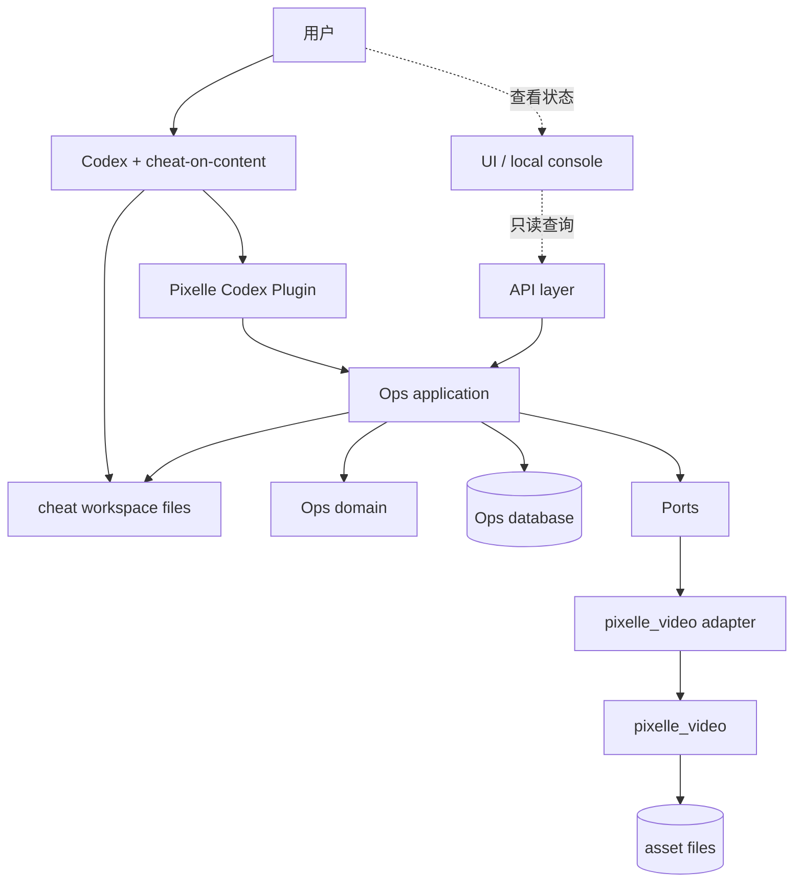

# Pixelle 从 main 重做技术架构方案

版本：v1.0  
日期：2026-06-20  
状态：PRD 配套技术方案  
关联文档：`docs/zh/product/pixelle-main-rebuild-prd.md`  
实施计划：`docs/zh/product/pixelle-main-rebuild-implementation-plan.md`  

## 1. 架构目标

本方案只服务一个目标：

```text
把 Pixelle 拆成边界清楚、互不侵入、通过契约协作的模块。
```

模块拆分不是为了做更多系统，而是为了让每个模块只承担自己的责任：

1. `pixelle_video` 继续做内容生成。
2. `cheat-on-content` 继续做 Codex 方法论和校准工作流。
3. Pixelle Codex Plugin 作为 Codex 的工具入口。
4. Pixelle 新增的运营模块只做产品状态、证据链、闭环编排和受控写入。
5. API 主要做只读查询和调试入口，不承载核心规则。
6. Pixelle UI 只做只读展示，不做运营入口。

技术上的正确分层不是先拆服务，而是先拆依赖方向、数据所有权和写入权限。

## 2. 总体原则

### 2.1 产品状态只有一个真相源

正式产品状态只存在于 Pixelle Ops 数据库。

包括：

1. 运营项目。
2. 运营周期。
3. 内容实验。
4. 预测锁定记录。
5. 生成任务绑定关系。
6. 发布证据。
7. 数据快照。
8. 复盘结果。
9. 项目记忆。

Codex 输出、cheat workspace 文件、生成目录、日志、截图、demo 文件都不能直接等同于产品状态。

### 2.2 模块之间只通过契约协作

禁止跨模块直接读写内部表、内部文件和内部状态。

允许的协作方式只有四类：

1. Command：请求一个明确动作。
2. Query：读取一个明确视图。
3. Draft：外部系统提交待验证草稿。
4. Event：记录已发生事实。

### 2.3 生成模块不理解运营模块

`pixelle_video` 不应该 import Pixelle Ops，也不应该知道 OperatingProject、ContentExperiment、ProjectMemoryEvent 的业务规则。

它只接收一个生成请求，产出生成任务和媒体资产。运营上下文可以作为 opaque metadata 附带，但生成模块不能根据这些字段改变产品状态。

### 2.4 Codex 不直接写产品真相

`cheat-on-content` 是运营脑和校准方法论，不是数据库客户端。

Codex 可以读取上下文、生成候选、写预测、做复盘草稿、提出记忆写入建议，但进入 Pixelle 产品状态前必须经过 Pixelle Ops 的校验和 apply。

### 2.5 Codex Plugin 是运营入口

用户的运营动作默认发生在 Codex 对话中。

包括：

1. 创建或选择运营项目。
2. 开启运营周期。
3. 讨论候选内容。
4. 锁定预测。
5. 发起内容生成。
6. 登记发布证据。
7. 录入或导入指标。
8. 起草复盘。
9. 写入项目记忆。

Pixelle UI 不复刻这些流程，只展示这些动作执行后的状态、证据、资产和审计记录。

Codex 不直接调用数据库，也不直接改 cheat workspace 来改变 Pixelle 状态。Codex 通过 Pixelle Plugin 暴露的工具进入 Pixelle Ops。

### 2.6 失败必须停在真实失败层

生成失败、发布失败、指标缺失、预测缺失、权限缺失和配置缺失必须被真实暴露。

不能用 fallback、备注、占位状态或自动跳过让主流程看起来成功。

## 3. 模块边界

### 3.1 Pixelle Ops

Pixelle Ops 是新主线模块，负责运营闭环。

建议目录：

```text
ops/
  domain/
    entities.py
    policies.py
    state_machine.py
    errors.py
  application/
    commands.py
    queries.py
    use_cases.py
  adapters/
    generation_pixelle_video.py
    cheat_workspace.py
    codex_writeback.py
    asset_store.py
  infrastructure/
    models.py
    repository.py
    migrations/
codex_plugin/
  server.py
```

职责：

1. 定义 OperatingProject、OperationCycle、ContentExperiment 等核心对象。
2. 管理状态机和业务不变量。
3. 验证 Codex writeback draft。
4. 通过 adapter 调用内容生成。
5. 保存发布证据、数据快照、复盘和项目记忆。

### 3.2 Pixelle Codex Plugin

Pixelle Codex Plugin 是 Codex 侧的工具入口，不是产品状态真相源。

建议目录：

```text
codex_plugin/
  __init__.py
  server.py
```

P0 暴露工具：

```text
pixelle_get_current
pixelle_create_project
pixelle_create_cycle
pixelle_create_experiment
pixelle_lock_prediction
pixelle_submit_generation_draft
pixelle_approve_generation_draft
pixelle_request_generation
pixelle_record_publish
pixelle_record_metrics
pixelle_write_retro
pixelle_write_memory
```

职责：

1. 把 Codex 的结构化工具调用转成 Pixelle Ops service 调用。
2. 为每次写入附带 `source`、`skill`、`workspace_path`、`confirmed_by_user`。
3. 返回下一步动作和阻断原因。
4. 不直接写 SQLite。
5. 不读取或修改 `pixelle_video` 内部状态。

本地启动方式见 `docs/zh/product/pixelle-codex-plugin-p0-usage.md`。P0 固定为 stdio MCP server，不提供远程插件发布包。

后续如果需要正式插件包或 MCP 发布形态，只包装这一层，不改变 Pixelle Ops 内核。

### 3.3 Pixelle Ops 拥有的数据

1. `operating_projects`
2. `operation_cycles`
3. `content_experiments`
4. `content_items`
5. `prediction_locks`
6. `media_asset_refs`
7. `publish_records`
8. `metrics_snapshots`
9. `content_retros`
10. `project_memory_events`
11. `codex_writeback_drafts`
12. `audit_events`

允许依赖：

1. Python 标准库。
2. 数据库 ORM 或轻量 repository。
3. 自己定义的 port interface。

禁止依赖：

1. `api.routers`
2. `web`
3. 前端应用。
4. Codex skill 内部实现。
5. `pixelle_video` 的深层内部服务。

Pixelle Ops 可以通过 adapter 调用 `pixelle_video.service` 或公开 API，但不能把 `pixelle_video` 的内部模型泄漏进 domain 层。

### 3.4 pixelle_video

`pixelle_video` 是现有开源骨架的内容生成引擎。

职责：

1. 文案、脚本、图片、TTS、视频、发布包生成。
2. 生成任务进度。
3. 生成资产持久化。
4. 现有发布能力的底层封装。

拥有的数据：

1. 生成配置。
2. 生成任务输出。
3. 媒体文件。
4. 任务目录。
5. 现有 history 或 publish 本地记录。

禁止承担：

1. 判断哪条内容值得做。
2. 判断预测是否有效。
3. 判断内容是否已经正式发布。
4. 写 ProjectMemoryEvent。
5. 直接读写 Ops 数据库。

对 Pixelle Ops 暴露的最小契约：

```python
class GenerationPort:
    def generate(self, request: GenerationRequest) -> GenerationJobRef:
        ...

    def get_job(self, job_id: str) -> GenerationJobStatus:
        ...
```

`GenerationRequest` 必须携带运营上下文，但该上下文对 `pixelle_video` 是普通 metadata。

```json
{
  "input": {
    "script": "最终脚本或生成指令",
    "style": "生成风格",
    "platform": "xiaohongshu"
  },
  "operation_context": {
    "operating_project_id": "op_123",
    "operation_cycle_id": "cycle_123",
    "content_experiment_id": "exp_123",
    "content_item_id": "item_123",
    "prediction_lock_id": "pred_123"
  }
}
```

### 3.5 cheat-on-content workspace

cheat workspace 是 Codex 方法论工作区，不是 Pixelle 数据库。

职责：

1. 保存 rubric。
2. 保存候选池。
3. 保存盲预测日志。
4. 保存拍摄、发布、复盘工作记录。
5. 支持校准循环。

典型文件：

```text
<cheat-workspace>/
  .cheat-state.json
  rubric_notes.md
  WORKFLOW.md
  STATUS.md
  candidates.md
  scripts/
  predictions/
  videos/
  benchmark.md
  audience.md
```

Pixelle 对 cheat workspace 的使用方式分两类：

1. Read-only summary：读取状态摘要，展示给用户或提供给 Codex。
2. Writeback draft：接收 Codex 产出的结构化草稿，等待 Pixelle Ops 校验并 apply。

Pixelle 不应该把 cheat workspace 当成可随意改写的数据库。尤其不能扫描文件后自动把所有内容写入产品状态。

### 3.6 Codex Integration

Codex Integration 是 Pixelle Plugin、Pixelle Ops 和 `cheat-on-content` 之间的主操作适配层。

建议目录：

```text
ops/adapters/
  cheat_workspace.py
  codex_writeback.py
```

职责：

1. 导出 Pixelle 上下文给 Codex。
2. 读取 cheat workspace 摘要。
3. 接收结构化 writeback draft。
4. 调用 Pixelle Ops 的 apply use case。
5. 为 Codex 提供下一步动作和阻断原因。

它不拥有产品状态，只负责转换格式和记录来源。

### 3.7 API 层

API 是薄入口。P0 默认只作为只读查询和调试入口；运营写入只走 Pixelle Codex Plugin。

1. UI query API：给 Pixelle UI 做只读展示。
2. Debug query API：给本地排查状态和证据链。

建议新增：

```text
api/routers/ops.py
api/schemas/ops.py
```

职责：

1. 参数解析。
2. 鉴权或本地访问控制。
3. 调用 `ops.application` use case。
4. 返回 view model。
5. 区分 plugin command 和 query 权限。

禁止：

1. 在 router 里写状态机。
2. 在 schema 里写业务不变量。
3. 直接操作 `pixelle_video`。
4. 直接修改 cheat workspace。
5. 为 UI 暴露绕过 Plugin/Ops 的状态修改入口。

### 3.8 UI 层

P0 不需要新建大型前端应用。UI 的定位是只读展示面板。

最小可接受方式：

1. 继续使用现有 `web/` 或简单本地页面展示状态。
2. 展示当前项目、当前周期、当前阻断、下一步和最近 Codex 动作。
3. 展示生成资产、发布证据、指标快照、复盘和项目记忆。
4. 只调用 query API。
5. 不在前端复制核心规则。
6. 不提供候选、预测、发布、复盘和记忆写入的主操作表单。

如果后续要恢复 `apps/console`，必须作为单独阶段进入，不应作为 P0 必须项。

### 3.9 Asset Store

Asset Store 保存生成产物，不保存运营判断。

职责：

1. 媒体文件路径。
2. 缩略图。
3. 生成包。
4. 可发布文件。

Pixelle Ops 只保存 `MediaAssetRef`：

```json
{
  "id": "asset_123",
  "content_item_id": "item_123",
  "kind": "video",
  "uri": "file:///.../outputs/asset_123.mp4",
  "source_job_id": "job_123",
  "checksum": "sha256:...",
  "created_at": "2026-06-20T10:00:00+08:00"
}
```

不把大文件、截图、demo HTML 放进主线分支。

## 4. 依赖方向

依赖方向必须稳定：



关键限制：

1. `pixelle_video` 不能依赖 `ops`。
2. `ops.domain` 不能依赖 `api`、`web`、`apps`、`pixelle_video`。
3. `api` 可以依赖 `ops.application`，但不能绕过它访问 repository。
4. UI 只能调用 API 或 query service，不能直接写数据库。
5. Codex 只能通过 Pixelle Codex Plugin 提交命令或 draft，不能直接写产品表。
6. UI 不能调用 Pixelle Codex Plugin 写工具。

## 5. 核心数据契约

### 5.1 ContextExport

Pixelle 提供给 Codex 的上下文必须是只读快照。

```json
{
  "export_version": 1,
  "generated_at": "2026-06-20T10:00:00+08:00",
  "operating_project": {
    "id": "op_123",
    "name": "PetWoods 小红书增长项目",
    "channel": "xiaohongshu",
    "long_term_goal": "验证清洁内容是否能稳定带来购买意向"
  },
  "current_cycle": {
    "id": "cycle_123",
    "goal": "清洁内容验证",
    "primary_metric": "qualified_comments",
    "retro_window_days": 3
  },
  "active_experiments": [
    {
      "id": "exp_123",
      "stage": "candidate_confirmed",
      "question": "宠物清洁前后对比是否比痛点讲解更容易触发收藏",
      "blocked_reason": "prediction_required"
    }
  ],
  "project_memory": [
    {
      "id": "mem_123",
      "summary": "清洁前后对比内容比单纯产品功能介绍更容易引发评论询问"
    }
  ]
}
```

Codex 可以基于它工作，但不能把这个快照写回当作事实。

### 5.2 CheatWorkspaceSummary

读取 cheat workspace 时，只返回摘要。

```json
{
  "workspace_path": "/Users/.../petwoods-cheat",
  "state_schema_version": 1,
  "mode": "cold-start",
  "candidate_count": 12,
  "prediction_count": 3,
  "pending_retro_count": 1,
  "latest_status_mtime": "2026-06-20T10:00:00+08:00"
}
```

禁止：

1. 自动导入所有预测文件。
2. 自动覆盖 Pixelle 状态。
3. 自动修改 rubric。

### 5.3 CodexWritebackDraft

Codex 进入 Pixelle 的唯一写入入口是 draft。

```json
{
  "id": "draft_123",
  "source": {
    "kind": "codex",
    "skill": "cheat-on-content",
    "workspace_path": "/Users/.../petwoods-cheat",
    "source_file": "predictions/2026-06-20_exp123_cleaning.md"
  },
  "operation": "lock_content_prediction",
  "target": {
    "operating_project_id": "op_123",
    "operation_cycle_id": "cycle_123",
    "content_experiment_id": "exp_123"
  },
  "payload": {
    "prediction_text": "预计收藏率高于本账号近 3 条均值",
    "expected_bucket": "above_baseline",
    "confidence": "medium",
    "basis": "对标样本中前后对比类内容评论意图更明确"
  },
  "status": "pending_validation",
  "created_at": "2026-06-20T10:00:00+08:00"
}
```

允许的 draft operation：

1. `create_content_experiment`
2. `lock_content_prediction`
3. `record_publish_evidence`
4. `record_metrics_snapshot`
5. `record_retro_observation`
6. `write_project_memory_event`

不允许的 draft operation：

1. `set_content_published_without_evidence`
2. `overwrite_prediction`
3. `mark_generation_success`
4. `delete_prediction_history`
5. `change_rubric_without_cheat_protocol`

### 5.4 ApplyResult

每次 apply 必须返回明确结果。

```json
{
  "draft_id": "draft_123",
  "status": "applied",
  "applied_entity": {
    "kind": "prediction_lock",
    "id": "pred_123"
  },
  "audit_event_id": "audit_123"
}
```

失败时必须暴露原因：

```json
{
  "draft_id": "draft_123",
  "status": "rejected",
  "errors": [
    {
      "code": "prediction_not_blind",
      "message": "该实验已经存在发布或指标证据，不能再写入 blind prediction"
    }
  ]
}
```

### 5.5 GenerationJobRequest

Ops 调用生成模块时使用统一请求。

```json
{
  "content_item_id": "item_123",
  "generation_kind": "short_video",
  "input": {
    "script": "最终脚本",
    "title": "标题",
    "caption": "小红书文案",
    "style_preset": "clean_before_after"
  },
  "operation_context": {
    "operating_project_id": "op_123",
    "operation_cycle_id": "cycle_123",
    "content_experiment_id": "exp_123",
    "prediction_lock_id": "pred_123"
  }
}
```

提交前置校验：

1. OperatingProject 存在。
2. OperationCycle 属于该项目。
3. ContentExperiment 属于该周期。
4. PredictionLock 存在且未被结果污染。
5. ContentItem 属于该实验。

## 6. 状态机

### 6.1 ContentExperiment 状态

```text
draft
  -> candidate_confirmed
  -> prediction_locked
  -> generation_requested
  -> generation_failed
  -> asset_ready
  -> publish_ready
  -> published
  -> measured
  -> retro_done
  -> memory_written
```

每个状态只表示一个事实，不表示愿望。

### 6.2 阻断规则

| 当前状态 | 下一步 | 阻断条件 |
|---|---|---|
| `draft` | 确认候选 | 缺少项目或周期 |
| `candidate_confirmed` | 锁定预测 | 已经存在发布或指标证据 |
| `prediction_locked` | 内容生成 | 缺少可生成输入 |
| `generation_requested` | 资产可用 | 生成任务失败或未完成 |
| `asset_ready` | 发布准备 | 用户未采用资产 |
| `publish_ready` | 发布确认 | 缺少平台 URL、post id 或平台响应 |
| `published` | 数据录入 | 缺少发布证据 |
| `measured` | 正式复盘 | 缺少预测或指标 |
| `retro_done` | 写入记忆 | 复盘结论未被用户接受 |

### 6.3 预测锁定不变量

`PredictionLock` 一旦写入，不允许覆盖。

如果确实要重做，只能新增一条 `PredictionLockRedo` 或 observation，并保留原记录。

规则：

1. `published_at` 存在后不能新增 blind prediction。
2. `metrics_snapshot` 存在后不能新增 blind prediction。
3. `retro_done` 后不能修改 prediction 文本。
4. Codex draft 不能覆盖已应用的 prediction。

### 6.4 发布证据不变量

发布状态只能由 `PublishRecord` 推导。

以下字段不能单独导致 `published`：

1. `confirmation_note`
2. `status = "published"`
3. `scheduled_at`
4. `generation_job.status = "success"`
5. `codex_message = "已发布"`

有效证据至少需要一个：

1. 平台 URL。
2. 平台 post id。
3. Buffer post id 和 sent 状态。
4. 平台 API 返回的等价发布响应。

## 7. 关键流程

### 7.1 Codex 读取上下文

```text
用户在 Codex 中发起运营动作
  -> Pixelle 导出 ContextExport
  -> Codex 读取 cheat workspace summary
  -> Codex 使用 cheat-on-content 产生候选、评分或预测草稿
  -> Codex 提交 CodexWritebackDraft
  -> Pixelle Ops 校验
  -> 用户确认 apply
  -> 产品状态更新
  -> Pixelle UI 展示最新状态
```

这个流程保证 Codex 是运营入口，但不拥有产品真相。

### 7.2 创建内容实验

```text
候选内容来源
  -> 用户在 Codex 中描述，或 Codex 基于上下文提出
  -> Pixelle Ops validate
  -> 创建 ContentExperiment
  -> 状态进入 candidate_confirmed
  -> UI 展示候选和实验状态
```

校验点：

1. 必须属于真实 OperatingProject。
2. 必须属于当前 OperationCycle。
3. 必须说明验证问题。
4. 不要求一开始就有生成资产。

### 7.3 锁定预测

```text
Codex 使用 cheat-on-content 写预测
  -> 提交 lock_content_prediction draft
  -> Pixelle Ops 检查是否 blind
  -> 用户确认
  -> 写入 PredictionLock
  -> 状态进入 prediction_locked
  -> UI 展示锁定预测和来源
```

如果已经有发布证据或指标，只能写 observation，不能写 blind prediction。

### 7.4 触发内容生成

```text
ContentExperiment 已 prediction_locked
  -> 用户在 Codex 中选择生成
  -> Ops 组装 GenerationJobRequest
  -> generation_pixelle_video adapter 调用 pixelle_video
  -> 返回 job_id
  -> Ops 保存 GenerationJobRef
  -> 生成完成后保存 MediaAssetRef
  -> UI 展示生成进度和资产预览
```

失败处理：

1. 配置缺失：返回 `generation_config_missing`。
2. 上游 API 失败：返回 `generation_provider_failed`。
3. 文件持久化失败：返回 `asset_persistence_failed`。
4. 任何失败都不能推进到 `asset_ready`。

### 7.5 发布确认

```text
用户在 Codex 中登记手动发布证据，或系统发布返回平台响应
  -> 提供平台 URL / post id / Buffer 响应
  -> Ops 创建 PublishRecord
  -> ContentExperiment 推导为 published
  -> UI 展示发布证据
```

如果只是用户说“我发了”，但没有证据，状态保持 blocked，允许保存备注，但备注不改变发布状态。

### 7.6 数据回收和复盘

```text
PublishRecord 存在
  -> 用户在 Codex 中录入、导入或确认 MetricsSnapshot
  -> Ops 检查指标归属
  -> Codex 使用 cheat-retro 起草复盘
  -> Pixelle Ops 校验是否有 prediction + publish + metrics
  -> 正式 ContentRetro 或 observation
  -> 用户确认写入 ProjectMemoryEvent
  -> UI 展示指标、复盘和项目记忆
```

正式 retro 必须满足：

1. 有 PredictionLock。
2. 有 PublishRecord。
3. 有 MetricsSnapshot。

缺任何一个，只能是 observation。

## 8. 数据库建议

P0 可以使用 SQLite，不需要一开始上复杂服务。

建议表结构按不变量设计，而不是按页面设计。

```text
operating_projects
operation_cycles
content_experiments
content_items
prediction_locks
generation_jobs
media_asset_refs
publish_records
metrics_snapshots
content_retros
project_memory_events
codex_writeback_drafts
audit_events
```

### 8.1 表关系

```text
OperatingProject 1 -> N OperationCycle
OperationCycle 1 -> N ContentExperiment
ContentExperiment 1 -> N ContentItem
ContentExperiment 1 -> N PredictionLock
ContentItem 1 -> N GenerationJob
ContentItem 1 -> N MediaAssetRef
ContentItem 1 -> N PublishRecord
PublishRecord 1 -> N MetricsSnapshot
ContentExperiment 1 -> N ContentRetro
OperatingProject 1 -> N ProjectMemoryEvent
CodexWritebackDraft 0/1 -> 1 applied entity
```

### 8.2 审计字段

核心表至少保留：

1. `created_at`
2. `updated_at`
3. `created_by`
4. `source`
5. `source_ref`

Codex 写入必须额外保留：

1. `skill_name`
2. `workspace_path`
3. `source_file`
4. `draft_id`
5. `applied_by`
6. `applied_at`

## 9. Plugin 与 API 设计

P0 的写入口是 Pixelle Codex Plugin。HTTP API 只围绕 UI 只读展示和本地调试，不做后台 CRUD。

### 9.1 UI Query API

UI 只能使用 query API。

```text
GET /api/ops/current
GET /api/ops/projects/{project_id}
GET /api/ops/projects/{project_id}/context-export
GET /api/ops/projects/{project_id}/cheat-workspace-summary
GET /api/ops/experiments/{experiment_id}
```

### 9.2 Pixelle Codex Plugin 工具入口

Codex 的写入口是 Pixelle Codex Plugin。P0 使用本地 MCP/FastMCP server 形式承载工具；API 只保留查询、调试和展示用途。

```text
pixelle_create_project
pixelle_create_cycle
pixelle_create_experiment
pixelle_lock_prediction
pixelle_submit_generation_draft
pixelle_approve_generation_draft
pixelle_request_generation
pixelle_record_publish
pixelle_record_metrics
pixelle_write_retro
pixelle_write_memory
```

`pixelle_request_generation` 只能从已批准的 generation draft 生成内容，不能直接接收 Codex 临时拼出的自由文案。生成前必须先写入 `generation_drafted`，用户审核通过后再写入 `generation_draft_approved`。

`generation_drafted.payload.text` 只能保存最终上屏字幕或口播稿。生成说明、发布标题、发布正文、标签等辅助字段必须放在其他结构化字段或后续发布证据里，不能混入生成正文。

### 9.3 State transition result

所有 Pixelle Codex Plugin 写工具都返回 state transition result：

```json
{
  "status": "ok",
  "entity": {
    "kind": "content_experiment",
    "id": "exp_123",
    "stage": "prediction_locked"
  },
  "next_action": {
    "kind": "generate_content",
    "blocked": false
  }
}
```

UI 展示状态转换结果，但不能直接发起写工具。

业务错误也必须是结构化结果，而不是 Python exception 文本：

```json
{
  "status": "error",
  "error": {
    "code": "prediction_required",
    "message": "Content generation requires a locked prediction."
  },
  "next_action": {
    "kind": "resolve_error",
    "blocked": true,
    "reason": "prediction_required"
  }
}
```

HTTP API 的业务错误使用同一套 `error.code`，放在 `detail.error.code`。

## 10. 测试边界

测试重点不是页面数量，而是不变量。

### 10.1 Domain tests

文件建议：

```text
tests/ops/test_state_machine.py
tests/ops/test_publish_evidence.py
tests/ops/test_prediction_lock.py
```

覆盖：

1. 无项目不能进入主流程。
2. 无预测不能生成。
3. 发布备注不能变成发布证据。
4. 指标不能绑定到未发布内容。
5. 已有结果后不能写 blind prediction。
6. observation 不进入预测校准。

### 10.2 Adapter tests

文件建议：

```text
tests/ops/test_generation_adapter.py
tests/ops/test_cheat_workspace_adapter.py
tests/ops/test_codex_writeback.py
```

覆盖：

1. `operation_context` 被传给生成请求。
2. 生成失败或无资产引用不推进状态。
3. cheat workspace summary 是只读。
4. URL 形式的 workspace path 被拒绝。
5. Codex draft 未 apply 前不改变产品状态。

### 10.3 API contract tests

文件建议：

```text
tests/api/test_ops_contract.py
```

覆盖：

1. command 返回 next action。
2. direct publish status write 被拒绝。
3. writeback draft validate/apply 分离。
4. 错误信息指向真实缺失证据。
5. UI query API 不暴露 command 能力。

## 11. 分阶段落地

### P0：跑通真实最小闭环

P0 是当前唯一执行范围。

产出：

1. Pixelle Ops 基础对象和状态规则。
2. 本地 SQLite repository/store。
3. Pixelle Codex Plugin 创建项目、周期、内容实验。
4. Pixelle Codex Plugin 锁定预测。
5. 通过 adapter 调用 `pixelle_video`。
6. Pixelle Codex Plugin 记录发布证据。
7. Pixelle Codex Plugin 录入 metrics。
8. Pixelle Codex Plugin 写 retro 和 memory。
9. UI query API 只读展示当前状态。

验收：

1. 单条内容可以完整跑通。
2. 每个阶段缺证据时 blocked。
3. 生成失败不会被当作成功。
4. UI 不参与写入也能展示完整状态。

不做：

1. 新前端。
2. 新营销后台。
3. 自动发布。
4. 自动指标拉取。
5. 正式远程插件包装。

### P1：cheat-on-content 深度接入

产出：

1. ContextExport。
2. CheatWorkspaceSummary。
3. CodexWritebackDraft。
4. validate/apply。

验收：

1. Codex 可以辅助运营。
2. Codex 不直接写产品状态。
3. cheat workspace 不被 Pixelle 自动污染。

### P2：只读展示界面

产出：

1. 当前项目页。
2. 当前状态页。
3. 证据链结果页。
4. 生成资产预览。
5. Codex draft/apply 审计记录。

不做：

1. 多页面营销后台。
2. Media Core 工作台。
3. 大型 dashboard。
4. 运营操作表单。

### P3：证据自动化

只有在 P0 稳定后再考虑：

1. 平台数据 readback。
2. Buffer 发布状态回读。
3. 多平台指标适配。
4. 更完整的内容队列。
5. 更复杂的资源设置。

### P4：长期学习层

只有在 P0/P1 有真实运营数据后再考虑：

1. ProjectMemory 结构升级。
2. rubric 与实际表现的长期校准。
3. 跨周期复盘摘要。
4. 可解释的下一轮建议。

## 12. 从 main 重做时的代码策略

### 12.1 保留 main 的内容生成骨架

保留：

1. `pixelle_video/`
2. `api/`
3. `web/`
4. `tests/` 中与生成、发布、配置相关的现有测试。

不要在 P0 里重构 `pixelle_video` 内部结构。

### 12.2 新增 ops，而不是恢复当前大分支的 marketing

当前大分支的 `marketing/` 可以作为素材参考，但不建议整目录搬回。

原因：

1. 它已经混合了产品模型、API、前端假设和多轮修补。
2. 它和 `apps/console` 强绑定后容易再次膨胀。
3. P0 真正需要的是不变量和竖切闭环，不是完整营销后台。

推荐做法：

1. 从 main 新分支。
2. 新建轻量 `ops/`。
3. 手工摘取当前分支中已验证的不变量逻辑。
4. 保留测试意图，重写更小的测试。
5. 不 cherry-pick 大提交。

### 12.3 API 只加一条主线

从 main 的 `api/app.py` 接入 `api/routers/ops.py`。

不要同时恢复：

1. `apps/console`
2. 多个后台页面
3. audit 产物
4. demo HTML
5. 大量 screenshots

## 13. 防止再次失控的硬约束

### 13.1 import 约束

必须可以用测试或脚本检查：

1. `pixelle_video` 不 import `ops`。
2. `ops/domain` 不 import `api`、`web`、`apps`、`pixelle_video`。
3. `api/routers/ops.py` 不直接 import `ops.infrastructure.models`。
4. UI 不直接 import repository。

### 13.2 LOC 约束

P0 推荐规模：

1. `ops/domain`：300 行以内。
2. `ops/application`：500 行以内。
3. `ops/adapters`：500 行以内。
4. API schema/router：400 行以内。
5. 测试：1,500 行以内。
6. UI 只读展示代码：500 行以内。

超过这些数字时，优先拆阶段，不要继续堆。

### 13.3 文件约束

禁止进入 P0 PR：

1. 临时实验运行产物。
2. `audits/` 截图。
3. demo HTML。
4. 大量静态 assets。
5. 和 P0 闭环无关的前端页面。
6. 临时迁移脚本。
7. 仅为让测试通过而新增的 fallback。

### 13.4 提交约束

每个提交只服务一个不变量或一个竖切动作。

推荐提交顺序：

1. `feat: add ops domain state machine`
2. `feat: add ops persistence`
3. `feat: add ops API commands`
4. `feat: add generation adapter`
5. `feat: add codex writeback drafts`
6. `feat: add minimal current workflow view`

不接受：

1. `feat: add marketing console`
2. `chore: move many files`
3. `fix: make everything pass`
4. `feat: add all ops features`

## 14. 何时才需要拆服务

P0 不需要微服务。

先用模块边界解决耦合问题。只有出现以下情况才拆服务：

1. 生成任务需要独立 worker 和资源隔离。
2. 多个本地/远程客户端同时访问 Ops。
3. 平台数据 readback 需要独立定时任务。
4. 媒体生成和运营状态的部署节奏明显不同。

即使拆服务，契约不变：

1. Ops 仍通过 `GenerationPort` 调用生成。
2. Codex 仍通过 writeback draft 进入 Ops。
3. 发布证据仍由 PublishRecord 推导。
4. 产品状态仍以 Ops 数据库为真相源。

## 15. 最小实现路线

如果现在从 main 重做，最贴合目标的技术路线是：

```text
main
  -> 新建 ops/domain，先锁不变量
  -> 新建 ops/application，提供 use case
  -> 新建 ops/infrastructure，保存产品状态
  -> 新建 codex_plugin/server.py，暴露 Pixelle Codex Plugin 工具入口
  -> 新建 api/routers/ops.py，只暴露 UI query/debug API
  -> 新建 ops/adapters/generation_pixelle_video.py，接现有生成核心
  -> 新建 ops/adapters/cheat_workspace.py，只读摘要
  -> 新建 ops/adapters/codex_writeback.py，draft + validate + apply
  -> 最后才做只读展示 UI
```

这条路线对现有功能的影响最小：

1. 内容生成能力保留。
2. 现有 `pixelle_video` 不被运营逻辑污染。
3. cheat-on-content 保持为 Codex skill，不被复制进产品代码。
4. Pixelle 新增的运营能力有自己的状态和边界。
5. UI 不再牵引产品复杂度。
6. 后续要做 Console、自动发布、数据回收，都可以接同一套契约扩展。

## 16. 结论

Pixelle 的重做不应该变成“再写一个更大的后台”。

正确方案是：

```text
Ops 管状态和证据。
cheat-on-content 管方法和校准。
pixelle_video 管生成。
Pixelle Codex Plugin 管受控写入。
API 管只读查询和本地调试。
UI 管展示。
它们之间只通过明确契约协作。
```

这样模块可以分得细，但不会相互影响；模块可以配合，但不会互相吞掉边界。
